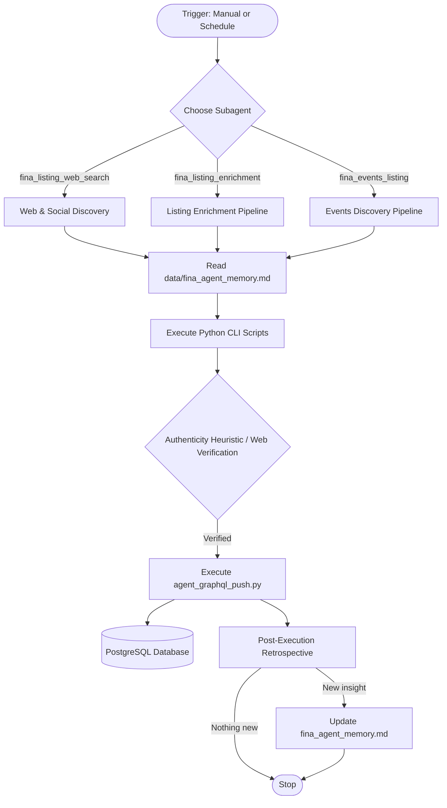

# Fina native IDE Agents Guide (AGENTS.md)

This document defines the architectural rules, workflows, and execution constraints for the autonomous AI agents in the `fina-agent` repository. It preserves core architecture, prevents drift, and keeps the codebase 100% native to Firebase and Google Antigravity.

---

## 🏛️ Architecture & Orchestration Overview

The `fina-agent` repository houses a pipeline of data discovery, verification, and enrichment agents for **Fina** (the Filipino-Australian community directory). Specialized Antigravity IDE subagents execute lightweight Python scripts locally, parse data, verify authenticity, and push results through a GraphQL layer into the live Fina PostgreSQL database.



---

## 🤖 Agent Registry

### Production Agents

The following 3 agents are production-ready and actively executing tasks:

#### 1. `fina_listing_web_search`
*   **Role**: Discovers new listing candidates on Facebook, Instagram, TikTok, web platforms, and Google Maps (via browser). Scoped to a **single task** (1 location × 1 category × 1 search template) with a limit of 30 new listings. **Single-task-per-session**: processes exactly one task, then stops.
*   **CLI Trigger**: `python3 scripts/agent_web_search_tasks.py --action next --city <CITY> --trace-id <CONVERSATION_ID>`
*   **Logic**:
    1. Reads shared agent memory from `data/fina_agent_memory.md`.
    2. Generates task permutations (idempotent) via `--action generate`, producing `data/listing_web_search_tasks_{city}.json`. Categories with `"cityOnly": true` or templates in `"cityOnlySearchTemplateIndices"` skip suburb permutations. Pass `--force` to regenerate while merging existing state.
    3. Claims next pending task via `--action next` (atomic via `fcntl.flock()`).
    4. Fetches existing city listings to `tmp/existing_city_listings_<CONVERSATION_ID>.json` for dedup context.
    5. Runs four sequential search rounds: Facebook (`site:facebook.com`), Instagram (`site:instagram.com`), General Web (excludes social), and Google Maps browser. Per-round page limits: 10 for social/web, unlimited scroll for Maps.
    6. Checks duplicates via `agent_check_duplicate.py`. Merge scenarios use `UpdateListingData`; new listings use `CreateListing`.
    7. Navigates to candidates via Chrome DevTools, extracting visible text/selectors only.
    8. For Rounds 1-3 candidates, enriches from Google Maps (lat/lng, address, hours, phone, Place ID, website). Adds `google-maps` tag on success.
    9. Pushes verified listings via `agent_graphql_push.py --operation CreateListing` (without `--generate-embeddings`) with self-correction on validation failure.
    10. Marks task `COMPLETED` with metrics via `--action complete`.
    11. Runs post-execution retrospective against `data/fina_agent_memory.md`. Updates within the 500-line budget if new insights were surfaced; skips otherwise.
    12. **Stops.** Does not claim the next task.

#### 2. `fina_listing_enrichment`
*   **Role**: Enriches existing listings by extracting reviews, synthesising AuE descriptions, updating operating hours, filling missing social URLs, detecting business closures, and flagging false-positive non-Filipino listings. Task-per-listing state machine. **Single-task-per-session**: processes exactly one listing, then stops.
*   **CLI Trigger**: `python3 scripts/agent_enrichment_tasks.py --action next --city <CITY> --trace-id <CONVERSATION_ID>`
*   **Logic**:
    1. Reads shared agent memory from `data/fina_agent_memory.md`.
    2. Generates one enrichment task per listing (idempotent) via `--action generate`. Pass `--force` to regenerate while merging existing state.
    3. Reads canonical category definitions from `data/categories.json`.
    4. Claims next pending task via `--action next` (atomic via `fcntl.flock()`).
    5. Extracts reviews in three sequential rounds, collecting closure signals passively: (a) Google Maps browser — reviews, operating hours, social links, closure banners; (b) Social media — testimonials, follower counts, closure announcements; (c) Web search — `"<name>" <city> reviews` across up to 5 pages, closure mentions.
    6. Pushes reviews individually via `CreateReview` mutation (idempotent via `externalSourceId`).
    7. Synthesises a 150-250 word AuE description combining reviews with existing description.
    8. Assesses business status using closure signals from step 5. Updates `status` only when it differs from the listing's current status (Maps banners are the strongest signal).
    9. Pushes enriched data via `UpdateListingData` — description, operating hours, social URLs/follower counts, and status (if changed).
    10. For `UNVERIFIED` listings, assesses Filipino affiliation using all collected context. Flags listings with zero affiliation as `FLAGGED` via `UpdateListingStatus`.
    11. Closes all browser tabs, marks task `COMPLETED` with metrics via `--action complete`.
    12. Runs post-execution retrospective against `data/fina_agent_memory.md`. Updates within the 500-line budget if new insights were surfaced; skips otherwise.
    13. **Stops.** Does not claim the next task.

#### 3. `fina_events_listing`
*   **Role**: Crawls social media pages of verified businesses to discover temporal upcoming events. Task-per-listing state machine (scans all social URLs for one listing). **Single-task-per-session**: processes exactly one listing, then stops.
*   **CLI Trigger**: `python3 scripts/agent_events_tasks.py --action next --city <CITY> --trace-id <CONVERSATION_ID>`
*   **Logic**:
    1. Reads shared agent memory from `data/fina_agent_memory.md`.
    2. Generates one events task per listing with social URLs (idempotent) via `--action generate`. Pass `--force` to regenerate while merging existing state.
    3. Claims next pending task via `--action next` (atomic via `fcntl.flock()`).
    4. For each non-null social URL (Facebook, Instagram, TikTok): fetches the scan bookmark via `agent_fetch_targets.py --type social-post-tracker`, navigates to the page via Chrome DevTools, captures follower count, and scans up to 10 posts backward from newest.
    5. Applies event classification heuristics: temporal validation (future dates only), missing date exclusion, content filtering (excludes menus, promos, recaps).
    6. Resolves relative post timestamps and event dates using Australian timezone offsets, converting to UTC ISO 8601.
    7. Pushes events via `CreateEvent` (with `--generate-embeddings`), follower counts via `UpdateListingSocialUrls`, and updated scan bookmarks via `UpsertSocialPostTracker`. Self-correction on validation failure (up to 3 retries).
    8. Closes all browser tabs, marks task `COMPLETED` with metrics via `--action complete`.
    9. Runs post-execution retrospective against `data/fina_agent_memory.md`. Updates within the 500-line budget if new insights were surfaced; skips otherwise.
    10. **Stops.** Does not claim the next task.

### Planned Agents (Not Yet Released)

The following agents exist as skills/scripts but are not yet production-ready. Their supporting CLI scripts are available in `scripts/` for future activation.

| Agent | Purpose | Key Script |
|---|---|---|
| `fina_listing_map_search` | Google Places API discovery | `scripts/agent_maps_search_tasks.py` |
| `fina_listing_embedder` | Vector embedding backfill | `scripts/agent_generate_embeddings.py` |
| `fina_docs_reviewer` | Documentation audit | Controlled at agent level |

---

## 🛠️ Setup & CLI Commands

### Environment Setup
```bash
# 1. Create and activate virtual environment
python3 -m venv .venv
source .venv/bin/activate

# 2. Install dependencies
pip install -r requirements.txt

# 3. Verify .env file is present at root containing:
# GEMINI_API_KEY, GOOGLE_MAPS_API_KEY, GCP_PROJECT
```

### CLI Script Reference

- **Web Search Tasks**:
  ```bash
  python3 scripts/agent_web_search_tasks.py --action generate --city <CITY> --trace-id <CONVERSATION_ID>
  python3 scripts/agent_web_search_tasks.py --action next --city <CITY> --trace-id <CONVERSATION_ID>
  python3 scripts/agent_web_search_tasks.py --action complete --city <CITY> --task-id <ID> --listings-created N --pages-searched N --candidates-evaluated N --candidates-rejected N --candidates-duplicate N --candidates-merged N --maps-results-scraped N --trace-id <CONVERSATION_ID>
  python3 scripts/agent_web_search_tasks.py --action summary --city <CITY> --trace-id <CONVERSATION_ID>
  ```
- **Enrichment Tasks**:
  ```bash
  python3 scripts/agent_enrichment_tasks.py --action generate --city <CITY> --trace-id <CONVERSATION_ID>
  python3 scripts/agent_enrichment_tasks.py --action next --city <CITY> --trace-id <CONVERSATION_ID>
  python3 scripts/agent_enrichment_tasks.py --action complete --city <CITY> --task-id <ID> --listings-enriched N --reviews-extracted N --reviews-pushed N --socials-enriched N --descriptions-rewritten N --maps-visits N --statuses-updated N --listings-flagged N --trace-id <CONVERSATION_ID>
  python3 scripts/agent_enrichment_tasks.py --action summary --city <CITY> --trace-id <CONVERSATION_ID>
  ```
- **Events Tasks**:
  ```bash
  python3 scripts/agent_events_tasks.py --action generate --city <CITY> --trace-id <CONVERSATION_ID>
  python3 scripts/agent_events_tasks.py --action next --city <CITY> --trace-id <CONVERSATION_ID>
  python3 scripts/agent_events_tasks.py --action complete --city <CITY> --task-id <ID> --events-discovered N --events-pushed N --social-urls-scanned N --follower-counts-updated N --bookmarks-updated N --trace-id <CONVERSATION_ID>
  python3 scripts/agent_events_tasks.py --action summary --city <CITY> --trace-id <CONVERSATION_ID>
  ```
- **Shared Utilities**:
  ```bash
  # Fetch targets (redirect output to prevent context bloat)
  python3 scripts/agent_fetch_targets.py --type <city-listings|missing-social|business-socials|social-post-tracker> --city <CITY> --trace-id <CONVERSATION_ID> > tmp/targets_output.json

  # Check duplicate
  python3 scripts/agent_check_duplicate.py --file tmp/existing_city_listings.json --name "<NAME>" --url "<URL>" --trace-id <CONVERSATION_ID>

  # GraphQL push (single payload)
  python3 scripts/agent_graphql_push.py --operation <CreateListing|UpdateListingData|UpdateListingSocialUrls|CreateReview|CreateEvent|UpsertSocialPostTracker> --variables @tmp/payload.json --trace-id <CONVERSATION_ID>
  ```

---

## 1. Core Architectural Constraints (Strict Invariants)

### 🚨 Rule 1.1: GraphQL Impersonation Client Pattern
*   **Rule**: Agents **must** read and write to the database exclusively using the GraphQL REST impersonation layer (`execute_graphql_operation`).
*   **Invariant**: No custom direct database drivers or raw SQL. The GraphQL layer enforces security context, audit triggers, and schema validation.

### 🚨 Rule 1.2: Python CLI Agent Workflows & Trace ID Correlation
*   **Rule**: All logic must run inside Python 3 CLI scripts in `/scripts`, structured into features under `/features`.
*   **Trace correlation**: Always pass `--trace-id <CONVERSATION_ID>` to CLI scripts and mutations.
*   **Safety Invariant**: Guard against acting recursively on the agent's own created/modified records.

### 🚨 Rule 1.3: Single Source of Truth for Categories
*   **Rule**: All business categories, verification rules, and display names must be defined in `data/categories.json`.
*   **Invariant**: Never hardcode category checks. Always load and validate via `load_valid_categories()`. Match parameter typing exactly when invoking `execute_graphql_operation`.

### 🚨 Rule 1.4: State Decoupling, Caching, and Concurrent Access
*   **File Locking**: Task state files must be accessed through `locked_next_task()` and `locked_complete_task()` from `features/scanning/task_lifecycle.py` (`fcntl.flock()`).
*   **Tmp File Isolation**: All temporary files in `tmp/` must include the agent's `CONVERSATION_ID` in the filename.
*   **Known Limitation**: `CreateListing` deduplication uses a TOCTOU pattern. Concurrent agents may both pass the dedup check before either inserts.

### 🚨 Rule 1.5: Test-Driven Development (TDD) Enforcement
*   **Rule**: Utilize TDD whenever pragmatic for Python helper logic, validation heuristics, and parsing utilities.
*   **Test-First**: Write failing assertions before implementing. Mock all network and database boundaries. Tests must complete in <1s.
*   **Live Cloud**: Actual execution connects directly to production/live resources. No emulators.

### 🚨 Rule 1.6: Vertical Slice Architecture & Bounded DDD Abstraction
*   **Rule**: Organize by feature domains under `/features`. Shared utilities under `features/shared/`.
*   **DRY**: Share infrastructure globally; keep feature slices isolated to avoid premature abstraction.

### 🚨 Rule 1.7: Type System Design
*   **Rule**: Annotate all signatures with PEP 484 type hints. Payload types must match database schemas exactly.

### 🚨 Rule 1.8: Self-Documenting Source Code
*   **Rule**: Use descriptive naming. Document public APIs with PEP 257 docstrings. Omit redundant "what" comments; reserve comments for "why".

### 🚨 Rule 1.9: Continuous Architectural Sync (CAS)
*   **Rule**: `AGENTS.md` is a living document. Update it whenever API standards change or new patterns are discovered.

### 🚨 Rule 1.10: Pragmatic Defensive Programming
*   **Rule**: Apply defensive programming at critical validation boundaries, deduplication heuristics, and API rate limits. Avoid defensive noise that doesn't serve data integrity.

### 🚨 Rule 1.11: Greenfield Rebuild & Breaking-Changes Policy
*   **Rule**: Evaluate rebuilding from scratch vs. incremental patches. The codebase is "breaking-changes safe" during active development.

### 🚨 Rule 1.12: Pure Functions Refactoring Policy
*   **Rule**: Prefer stateless, side-effect-free functions for parsers, heuristics, and deduplication logic.

### 🚨 Rule 1.13: Atomic Implementation Planning
*   **Rule**: Break implementation plans into very small, logical units. Micro-logical units enforce systematic methodology and simplify TDD.

### 🚨 Rule 1.14: Dual-Mode Scheduled Task Execution
*   **Rule**: Decouple core ingestion logic from orchestrator runners. Scripts must be executable both via Python CLI (local) and Cloud Run/Functions (cloud). Database calls target production resources.

### 🚨 Rule 1.15: Shared Agent Memory Protocol
*   **Rule**: Discovery, enrichment, and events agents **must** participate in the shared memory protocol via `data/fina_agent_memory.md`.
*   **Read Phase**: Read the memory file at session start, before task execution.
*   **Retrospective Phase**: At session end, evaluate: _"Did this execution surface any new insight not already captured?"_
    *   If **yes**: Merge into the appropriate section, enforce the **500-line** budget, write back.
    *   If **no**: Skip the update entirely.
*   **Budget Invariant**: Hard budget of **500 lines**. Prune stale/low-value entries when approaching the cap.
*   **Supersession Rule**: New insights that contradict existing entries **replace** them.
*   **Content Invariant**: Not a changelog or execution diary. Only distilled, reusable operational knowledge.

---

## 2. Business Logic Architecture (Three-Tier Approach)

1. **Security & Validation Layer (Declarative Database Boundary)**: CEL rules (`@auth`, `@check`) in GraphQL schemas for authorization and input validation.
2. **Heuristic & Filtering Layer (Local Agent Boundary)**: `features/scanning/heuristics.py` — drops false-positives, verifies Filipino affiliation.
3. **Deduplication & Merge Layer (Synchronous Pipeline Ingestion)**: `agent_graphql_push.py` — in-memory batch dedup and database similarity queries.

---

## 3. Native SaaS Capabilities

| Capability | Stack Choice |
|---|---|
| **Authentication** | Firebase Auth — impersonated service context via custom admin headers |
| **Media Assets** | Firebase Storage — secured via Storage Security Rules |
| **Observability** | `BackendObservability` — structured tracing routed to stderr, correlated by trace IDs |

---

## 4. Documentation-Driven Project Management

*   `/docs/guides/ide_agent_architecture.md`: Comprehensive architecture and runbook guide.
*   Future specifications under `/docs/specs/` as the project scales.
*   Once a spec is implemented and merged, the codebase becomes the source of truth.

---

## 4.5. Context Engineering & Routing Rules

| Target Files | Instructions (Read First) | Scope |
| :--- | :--- | :--- |
| `scripts/agent_*.py`, `features/**/*.py` | [python.instructions.md](file:///Users/ryan/.gemini/antigravity/scratch/fina/.agents/instructions/python.instructions.md) | Python CLI, parsers, heuristics, types |
| `tests/**/*.py` | [testing.instructions.md](file:///Users/ryan/.gemini/antigravity/scratch/fina/.agents/instructions/testing.instructions.md) | TDD, unit tests, mocks |
| `features/shared/observability.py` | [observability.instructions.md](file:///Users/ryan/.gemini/antigravity/scratch/fina/.agents/instructions/observability.instructions.md) | Logging, metrics, tracing |
| `data/categories.json` | [categories.json](file:///Users/ryan/.gemini/antigravity/scratch/fina-agent/data/categories.json) | Canonical categories and rules |

---

## 5. Evaluation & Verification Guidelines

Before concluding any development turn:
1. **Scan for Infinite Ingestion Loops**: Ensure search parameters prevent querying the same data repeatedly.
2. **Validate Categories**: Ensure all categories align with `data/categories.json`.
3. **Execute Test Suites**: `python3 -m unittest discover tests` — all assertions must pass.
