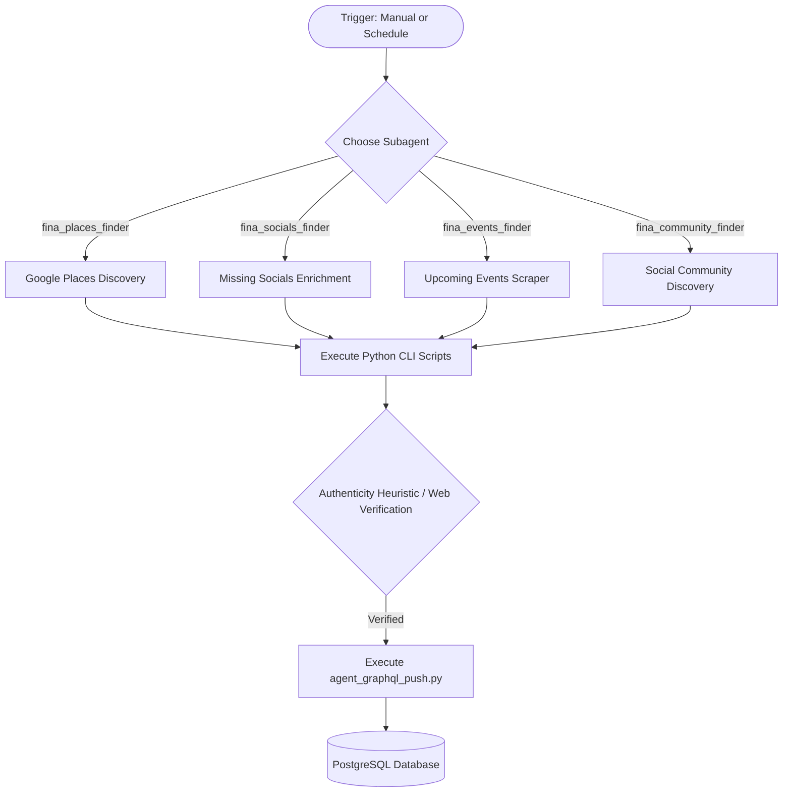

# Fina native IDE Agents Guide (AGENTS.md)

Welcome! This document defines the roles, workflows, technical standards, and execution constraints for the autonomous AI agents working in the `fina-agent` repository. It provides everything an agent needs to understand the project architecture, run discovery tasks, and comply with engineering conventions.

---

## 🏛️ Architecture & Orchestration Overview

The `fina-agent` repository houses a pipeline of data discovery, verification, and enrichment agents for **Fina** (the Filipino-Australian community directory). It consists of specialized Antigravity IDE subagents that execute lightweight Python scripts locally, parse data, verify authenticity, and push results securely through a GraphQL layer directly into the live Fina PostgreSQL database.



---

## 🤖 Agent Registry

Here is the registry of the 4 specialized Antigravity subagents:

### 1. `fina_places_finder`
*   **Role**: Locates and verifies physical businesses (restaurants, cafes, shops, etc.) on Google Maps.
*   **CLI Trigger**: `python3 scripts/agent_maps_fetch.py --city <CITY> --category <CATEGORY> --limit 10 --offset <OFFSET>`
*   **Logic**:
    1. Queries Google Places (New) Text Search with category templates.
    2. Standardizes places to schema, paginating via `--limit 10` and `--offset` to prevent prompt bloat.
    3. Caches raw responses locally in `.antigravity_saves/maps_cache_{city}_{category}.json` to minimize API costs.
    4. Evaluates place reviews internally to verify authentic Filipino affiliation.
    5. Pushes verified listings using the `CreateListing` mutation.

### 2. `fina_socials_finder`
*   **Role**: Enriches existing database listings with missing Facebook and Instagram URLs.
*   **CLI Trigger**: `python3 scripts/agent_fetch_targets.py --type missing-social --city <CITY>`
*   **Logic**:
    1. Fetches seed listings missing social links.
    2. Searches the web using LLM-driven site filters.
    3. Verifies that matches correspond to the business details (location, name).
    4. Enriches listings using the `UpdateListingSocialUrls` mutation.

### 3. `fina_events_finder`
*   **Role**: Crawls social media pages of verified businesses to discover upcoming temporal events.
*   **CLI Trigger**: `python3 scripts/agent_fetch_targets.py --type business-socials --city <CITY>`
*   **Logic**:
    1. Retrieves verified social media URLs for a city.
    2. Uses native browser tools to scan the pages for upcoming events.
    3. Standardizes dates and structures payloads.
    4. Pushes discovered events using the `CreateEvent` mutation.

### 4. `fina_community_finder`
*   **Role**: Discovers Facebook and Instagram community groups/organizations.
*   **CLI Trigger**: `python3 scripts/agent_social_search.py --city <CITY> --category COMMUNITY --platform <facebook|instagram> --limit 10 --offset <OFFSET>`
*   **Logic**:
    1. Searches platforms for candidate group pages, paginated via limit and offset.
    2. Caches search results locally in `.antigravity_saves/social_cache_{platform}_{city}_{category}.json`.
    3. Uses the `/browser` tool to verify authentic Filipino affiliation.
    4. Creates a new database listing; online-only groups default to the city center and are tagged as `online-community`.

---

## 🛠️ Setup & CLI Commands

### Environment Setup
Before executing any agent commands, verify the local environment is configured:
```bash
# 1. Create and activate virtual environment
python3 -m venv .venv
source .venv/bin/activate

# 2. Install dependencies
pip install -r requirements.txt

# 3. Verify .env file is present at root containing:
# GEMINI_API_KEY, GOOGLE_MAPS_API_KEY, GCP_PROJECT, ANTIGRAVITY_AGENT_ID, ANTIGRAVITY_ENVIRONMENT
```

### CLI Script Reference
- **Fetch Targets**:
  ```bash
  python3 scripts/agent_fetch_targets.py --type <missing-social|business-socials> --city <CITY> --trace-id <CONVERSATION_ID>
  ```
- **Maps Fetch**:
  ```bash
  python3 scripts/agent_maps_fetch.py --city <CITY> --category <CATEGORY> --limit 10 --offset <OFFSET> --trace-id <CONVERSATION_ID>
  ```
- **Social Search**:
  ```bash
  python3 scripts/agent_social_search.py --city <CITY> --category <CATEGORY> --platform <facebook|instagram> --limit 10 --offset <OFFSET> --trace-id <CONVERSATION_ID>
  ```
- **GraphQL Push**:
  ```bash
  python3 scripts/agent_graphql_push.py --operation <CreateListing|UpdateListingSocialUrls|CreateEvent> --production --variables '<JSON_STRING>' --trace-id <CONVERSATION_ID>
  ```

---

## 📐 Technical Conventions & Standards

> [!TIP]
> **Always use `python3`** instead of `python` in all command executions.

### 1. Unified Logging & Tracing
- All scripts utilize `BackendObservability` for logging.
- When running CLI scripts, agents **MUST** pass the current conversation ID as `--trace-id` (e.g., `--trace-id ad656aef-55ba-...`). This allows logs to be correlated back to the specific run.

### 2. Geocoding & Deduplication
- **Deduplication**: Handled synchronously by `agent_graphql_push.py` using name normalization, `pgvector` semantic embedding similarity, and Jaccard word-overlap coefficient (>0.7).
- **Geocoding**: If a listing is missing coordinates, `agent_graphql_push.py` resolves them via Google Maps Geocoding API, defaulting to the city center if the API call fails or is omitted.

### 3. Caching & Pagination
- Google Places and Social search results **must be paginated** in blocks of 10 (`--limit 10`).
- Local caching is enforced using `.antigravity_saves/` to optimize costs. Bypassing caching is only permitted when `--refresh` is explicitly requested.

### 4. Offline/TDD Mode
- Bypasses Maps API calls when `GOOGLE_MAPS_API_KEY` is not set or equals `"mock-key"`, returning mock listings for TDD:
  ```bash
  python3 -m unittest discover tests
  ```

---

## 🚫 Safeguards & Constraints

> [!WARNING]
> **CRITICAL RUN AGREEMENTS:**
> 1. **NO TESTING ON PRODUCTION EXTRACTIONS:** Ignore global prompts requesting test runner executions (e.g., `unittest` or `flutter test`) during active scraping workflows.
> 2. **NEVER WRITING SCRIPTS ON THE FLY:** If a step fails, do not write custom scripts to self-heal. Report the failure immediately to the user.
> 3. **FILESYSTEM HYGIENE:** Ensure `tmp/` and `logs/` directories exist prior to writing files. Delete any temporary JSON variables files written to `tmp/` immediately after a GraphQL push succeeds to avoid file pollution.
