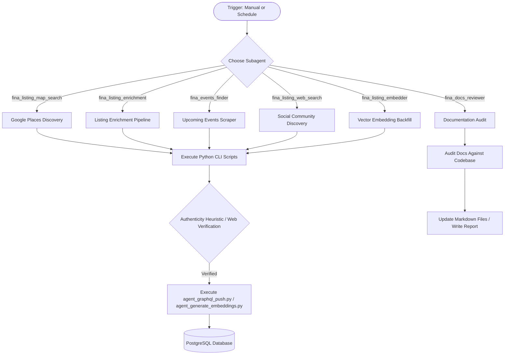

# Fina native IDE Agents Guide (AGENTS.md)

Welcome! This document defines the architectural rules, workflows, technical standards, and execution constraints for the autonomous AI agents working in the `fina-agent` repository. It ensures that all modifications preserve the core architecture, preventing architectural drift and keeping the codebase 100% native to the Firebase and Google Antigravity platforms.

---

## 🏛️ Architecture & Orchestration Overview

The `fina-agent` repository houses a pipeline of data discovery, verification, and enrichment agents for **Fina** (the Filipino-Australian community directory). It consists of specialized Antigravity IDE subagents that execute lightweight Python scripts locally, parse data, verify authenticity, and push results securely through a GraphQL layer directly into the live Fina PostgreSQL database.



---

## 🤖 Agent Registry

Here is the registry of the 6 specialized Antigravity subagents:

### 1. `fina_listing_map_search`
*   **Role**: Discovers and verifies Filipino businesses on Google Places (New). Each run is scoped to a single task (1 city × 1 category × 1 search template).
*   **CLI Trigger**: `python3 scripts/agent_maps_search_tasks.py --action next --city <CITY> --trace-id <CONVERSATION_ID>`
*   **Logic**:
    1. Generates all task permutations for a city (idempotent) via `scripts/agent_maps_search_tasks.py --action generate --city <CITY>`, producing `data/listing_map_search_tasks_{city}.json` with all (category × template) combinations at city-level only by default. Pass `--include-suburbs` to add suburb permutations. Pass `--force` to regenerate while merging existing task state.
    2. Retrieves the next pending task via `--action next`, which uses `fcntl.flock()` to atomically claim the task under an exclusive file lock, preventing concurrent agents from picking the same task. Returns the task's pre-formatted search query, category, and location.
    3. Runs `scripts/agent_fetch_targets.py --type city-listings --city <CITY> --trace-id <CONVERSATION_ID> > tmp/existing_city_listings_<CONVERSATION_ID>.json` to write existing city context to a per-agent temporary file.
    4. Calls `scripts/agent_maps_fetch.py --query "<formatted_query>" --city <CITY> --category <CATEGORY> --trace-id <CONVERSATION_ID>` to make a single Google Places (New) Text Search API call.
    5. Checks for duplicates by running `python3 scripts/agent_check_duplicate.py --file tmp/existing_city_listings_<CONVERSATION_ID>.json --name "<NAME>" --url "<URL>" --trace-id <CONVERSATION_ID>`.
    6. Evaluates name and description context internally to verify authentic Filipino affiliation.
    7. Pushes verified listings using the `CreateListing` mutation (without `--generate-embeddings`) with self-correction on validation failure.
    8. Marks the task as `COMPLETED` with metrics via `--action complete --task-id <ID> --listings-created N --places-fetched N --candidates-evaluated N --candidates-rejected N --candidates-duplicate N --trace-id <CONVERSATION_ID>`. Completion also uses `fcntl.flock()` to safely merge metrics without clobbering other agents' state.

### 2. `fina_listing_web_search`
*   **Role**: Discovers new listing candidates on Facebook, Instagram, TikTok, web platforms, and Google Maps (via browser). Each run is scoped to a single task (1 location × 1 category × 1 search template) with a limit of 30 new listings. Per-round page limits: 10 pages for social/web rounds, unlimited scroll for Maps.
*   **CLI Trigger**: `python3 scripts/agent_web_search_tasks.py --action next --city <CITY> --trace-id <CONVERSATION_ID>`
*   **Logic**:
    1. Generates all task permutations for a city (idempotent) via `scripts/agent_web_search_tasks.py --action generate --city <CITY>`, producing `data/listing_web_search_tasks_{city}.json` with all (category × template × location) combinations ordered city-first (all city-level tasks across all categories, then all suburb-level tasks) from `data/top_suburbs_per_city.json`. Categories with `"cityOnly": true` in `data/categories.json` (e.g. `GOVERNMENT`) produce only city-level tasks, skipping suburb permutations. Individual templates listed in `"cityOnlySearchTemplateIndices"` (e.g. metro-wide SERVICES templates) also skip suburb permutations. By default, skips if the file already exists; pass `--force` to regenerate while merging existing task state (status, metrics) into the new file via atomic replacement.
    2. Retrieves the next pending task via `--action next`, which uses `fcntl.flock()` to atomically claim the task under an exclusive file lock, preventing concurrent agents from picking the same task. Returns the task's pre-formatted search query, category, and location.
    3. Runs `scripts/agent_fetch_targets.py --type city-listings --city <CITY> --trace-id <CONVERSATION_ID> > tmp/existing_city_listings_<CONVERSATION_ID>.json` to write existing city context to a per-agent temporary file.
    4. Uses native web search with site-specific queries in four sequential rounds (Facebook, Instagram, General Web, and Google Maps browser). Rounds 1-3 use the task's `formatted_query` and scan up to 10 search result pages each. Round 4 uses the task's `maps_formatted_query` (which swaps `"in"` → `"near"` for suburb-level tasks to widen the geographic search radius) and navigates to Google Maps via Chrome DevTools (`https://www.google.com/maps/search/<query>`) and scrolls through the full results list, clicking into each result to extract business name, address, lat/lng (parsed from URL via `maps_browser_parser.parse_lat_lng_from_url()`), phone, website, and opening hours (parsed via `maps_browser_parser.parse_maps_opening_hours()`). Candidates from Round 4 skip the Step 6e Maps enrichment (already Maps-sourced) and receive the `google-maps` tag.
    5. Checks for duplicates by running `python3 scripts/agent_check_duplicate.py --file tmp/existing_city_listings_<CONVERSATION_ID>.json --name "<NAME>" --url "<URL>" --trace-id <CONVERSATION_ID>`.
    6. Navigates to candidate pages via Chrome DevTools, extracting only visible text/selectors to prevent raw HTML bloat.
    7. For Rounds 1-3 candidates, navigates to Google Maps via Chrome DevTools to enrich verified candidates with latitude/longitude (parsed from URL bar), address, opening hours, phone, Place ID, and website — filling only empty fields. Adds a `google-maps` tag when enrichment succeeds. Proceeds to push regardless of Maps enrichment outcome.
    8. Creates verified listings via `agent_graphql_push.py --operation CreateListing` (without `--generate-embeddings`, including `tiktokUrl` and `tiktokFollowers`) with self-correction on validation failure.
    9. Marks the task as `COMPLETED` with metrics via `--action complete --task-id <ID> --listings-created N --pages-searched N --candidates-evaluated N --candidates-rejected N --candidates-duplicate N --candidates-merged N --maps-results-scraped N --trace-id <CONVERSATION_ID>`. Completion also uses `fcntl.flock()` to safely merge metrics without clobbering other agents' state.

### 3. `fina_listing_enrichment`
*   **Role**: Enriches every existing listing in the database by extracting reviews, synthesising AuE descriptions, and filling missing social URLs. Uses a task-per-listing state machine for resumability and concurrency. Strictly targets a single city per run.
*   **CLI Trigger**: `python3 scripts/agent_enrichment_tasks.py --action next --city <CITY> --trace-id <CONVERSATION_ID>`
*   **Logic**:
    1. Generates one enrichment task per listing (idempotent) via `scripts/agent_enrichment_tasks.py --action generate --city <CITY>`, producing `data/listing_enrichment_tasks_{city}.json` by fetching all listings from the database via `ListAdminListings`. Pass `--force` to regenerate while merging existing task state.
    2. Retrieves the next pending task via `--action next`, which uses `fcntl.flock()` to atomically claim the task under an exclusive file lock. Returns the listing's identity, current description, source URL, and existing social URLs.
    3. Extracts reviews in three sequential rounds: (a) Google Maps browser via Chrome DevTools — navigates to the listing's Maps page and extracts up to 10 visible reviews, operating hours (parsed via `parse_maps_opening_hours()`), and social links; (b) Social media — visits existing Facebook/Instagram/TikTok pages to extract testimonials and capture missing social URLs + follower counts; (c) Web search — searches for `"<name>" <city> reviews` across up to 5 pages.
    4. Pushes extracted reviews to the database individually via `CreateReview` mutation (idempotent via `externalSourceId` uniqueness constraint).
    5. Synthesises a new 150-250 word description in Australian English (AuE) combining extracted reviews with the listing's existing description. The agent writes the description internally following an embedded style guide (friendly, professional tone; plain language accessible to non-native speakers).
    6. Pushes the enriched data via `UpdateListingData` mutation — includes the new description, operating hours (always overwritten to keep current), and any newly-discovered social URLs/follower counts (only filling previously-null fields).
    7. Marks the task as `COMPLETED` with metrics via `--action complete --task-id <ID> --listings-enriched N --reviews-extracted N --reviews-pushed N --socials-enriched N --descriptions-rewritten N --maps-visits N --trace-id <CONVERSATION_ID>`. Completion uses `fcntl.flock()` to safely merge metrics.

### 4. `fina_listing_embedder`
*   **Role**: Generates and updates description vector embeddings for listings missing them. Strictly targets a single city per run.
*   **CLI Trigger**: `python3 scripts/agent_generate_embeddings.py --city <CITY> --trace-id <CONVERSATION_ID> --limit <LIMIT> > tmp/fina_listing_embedder_run.json`
*   **Logic**:
    1. Fetches listings lacking embeddings for a city using `ListListingsMissingEmbedding`.
    2. Constructs a composite description string for each listing.
    3. Calls the local GenAI embedding function to generate a 768-dimension vector.
    4. Pushes the updated vector to the database via the `UpdateListingData` mutation (sleeping 0.2s between calls to prevent rate limits).
    5. Outputs a summary report as JSON to stdout, typically redirected to `tmp/fina_listing_embedder_run.json`.

### 5. `fina_events_finder`
*   **Role**: Crawls social media pages of verified businesses to discover upcoming temporal events. Strictly targets a single city per run.
*   **CLI Trigger**: `python3 scripts/agent_fetch_targets.py --type business-socials --city <CITY> --trace-id <CONVERSATION_ID> > tmp/business_socials_targets.json`
*   **Logic**:
    1. Retrieves verified social media URLs for a city and redirects them to a file to prevent context bloat.
    2. Retrieves the last scanned post timestamp bookmark from the database via the social-post-tracker endpoint.
    3. Uses Chrome DevTools to navigate to candidate pages, extracting only visible text/selectors (follower count and post content) to avoid outerHTML bloat.
    4. Evaluates posts chronologically, using current local time to resolve relative dates into UTC ISO 8601 strings and parsing follower counts to integers (including using the python parser for TikTok).
    5. Filters events against strict heuristics (future-bound, non-promotional) and pushes events, bookmarks, and follower counts (facebookFollowers, instagramFollowers, or tiktokFollowers) using mutations with validation self-correction on failure.


### 6. `fina_docs_reviewer`
*   **Role**: Reviews architecture guides, READMEs, and configurations for gaps and alignment.
*   **Trigger**: Controlled entirely at the agent level.
*   **Logic**:
    1. Audits documentation files against active python script arguments and configurations.
    2. Reports discrepancies and updates document details to keep them up to date.
    3. Files markdown run reports under `logs/`.

---

## 🛠️ Setup & CLI Commands

### Environment Setup
Before executing any agent commands, verify the local environment is configured:
```bash
# 1. Create and activate virtual environment
python3 -m venv .venv
source .venv/bin/activate

# 2. Install dependencies
pip install -r requirements.txt

# 3. Verify .env file is present at root containing:
# GEMINI_API_KEY, GOOGLE_MAPS_API_KEY, GCP_PROJECT
```

### CLI Script Reference
- **Fetch Targets**:
  ```bash
  # Fetch targets and redirect output to a file to prevent context bloat
  python3 scripts/agent_fetch_targets.py --type <missing-social|business-socials|city-listings|social-post-tracker> --city <CITY> --trace-id <CONVERSATION_ID> > tmp/targets_output.json

  # Retrieve social post tracker bookmark (requires --listing-id and --platform)
  python3 scripts/agent_fetch_targets.py --type social-post-tracker --listing-id <LISTING_UUID> --platform <facebook|instagram|tiktok> --trace-id <CONVERSATION_ID>
  ```
- **Maps Fetch**:
  ```bash
  # Single Google Places API call using a pre-formatted query
  python3 scripts/agent_maps_fetch.py --query "<QUERY>" --city <CITY> --category <CATEGORY> --trace-id <CONVERSATION_ID>
  ```
- **Listing Embeddings Generation**:
  ```bash
  python3 scripts/agent_generate_embeddings.py --city <CITY> --trace-id <CONVERSATION_ID> --limit <LIMIT> > tmp/fina_listing_embedder_run.json
  ```
- **Web Search Tasks**:
  ```bash
  # Generate task permutations for a city (idempotent, pass --force to regenerate)
  python3 scripts/agent_web_search_tasks.py --action generate --city <CITY> --trace-id <CONVERSATION_ID>

  # Get next pending task (atomically transitions to IN_PROGRESS)
  python3 scripts/agent_web_search_tasks.py --action next --city <CITY> --trace-id <CONVERSATION_ID>

  # Mark task as completed with metrics
  python3 scripts/agent_web_search_tasks.py --action complete --city <CITY> --task-id <ID> --listings-created N --pages-searched N --candidates-evaluated N --candidates-rejected N --candidates-duplicate N --candidates-merged N --maps-results-scraped N --trace-id <CONVERSATION_ID>

  # View aggregate progress
  python3 scripts/agent_web_search_tasks.py --action summary --city <CITY> --trace-id <CONVERSATION_ID>
  ```
- **Maps Search Tasks**:
  ```bash
  # Generate city-level task permutations (idempotent, pass --force to regenerate, pass --include-suburbs for suburb tasks)
  python3 scripts/agent_maps_search_tasks.py --action generate --city <CITY> --trace-id <CONVERSATION_ID>

  # Get next pending task (atomically transitions to IN_PROGRESS)
  python3 scripts/agent_maps_search_tasks.py --action next --city <CITY> --trace-id <CONVERSATION_ID>

  # Mark task as completed with metrics
  python3 scripts/agent_maps_search_tasks.py --action complete --city <CITY> --task-id <ID> --listings-created N --places-fetched N --candidates-evaluated N --candidates-rejected N --candidates-duplicate N --trace-id <CONVERSATION_ID>

  # View aggregate progress
  python3 scripts/agent_maps_search_tasks.py --action summary --city <CITY> --trace-id <CONVERSATION_ID>
  ```
- **Enrichment Tasks**:
  ```bash
  # Generate per-listing enrichment tasks for a city (idempotent, pass --force to regenerate)
  python3 scripts/agent_enrichment_tasks.py --action generate --city <CITY> --trace-id <CONVERSATION_ID>

  # Get next pending enrichment task (atomically transitions to IN_PROGRESS)
  python3 scripts/agent_enrichment_tasks.py --action next --city <CITY> --trace-id <CONVERSATION_ID>

  # Mark enrichment task as completed with metrics
  python3 scripts/agent_enrichment_tasks.py --action complete --city <CITY> --task-id <ID> --listings-enriched N --reviews-extracted N --reviews-pushed N --socials-enriched N --descriptions-rewritten N --maps-visits N --trace-id <CONVERSATION_ID>

  # View aggregate enrichment progress
  python3 scripts/agent_enrichment_tasks.py --action summary --city <CITY> --trace-id <CONVERSATION_ID>
  ```
- **Check Duplicate**:
  ```bash
  # Check local listings file for duplicate name or URL match
  python3 scripts/agent_check_duplicate.py --file tmp/existing_city_listings.json --name "<NAME>" --url "<URL>" --trace-id <CONVERSATION_ID>
  ```
- **GraphQL Push**:
  ```bash
  # Single Payload (Note: Omit --generate-embeddings for maps and web finder discovery agents)
  python3 scripts/agent_graphql_push.py --operation <CreateListing|UpdateListingSocialUrls|CreateEvent|UpsertSocialPostTracker> --variables @tmp/payload.json --trace-id <CONVERSATION_ID>
  
  # Bulk Payload (Array of JSON Objects)
  python3 scripts/agent_graphql_push.py --operation BulkCreateListing --variables @tmp/bulk_payload.json --trace-id <CONVERSATION_ID>
  ```
- **Migrate Embeddings** (one-time migration utility):
  ```bash
  python3 scripts/migrate_embeddings.py --city <CITY> --trace-id <CONVERSATION_ID>
  ```
- **Migrate Template Descriptions** (one-time migration utility):
  ```bash
  python3 scripts/migrate_template_descriptions.py --trace-id <CONVERSATION_ID>
  ```
- **Backup & Reset** (database reset utility):
  ```bash
  python3 scripts/agent_backup_and_reset.py --trace-id <CONVERSATION_ID>
  ```

---

## 1. Core Architectural Constraints (Strict Invariants)

Any agent executing tasks in this codebase must strictly adhere to the following rules:

### 🚨 Rule 1.1: GraphQL Impersonation Client Pattern
*   **Rule**: The Python discovery and enrichment agents **must** read and write to the database exclusively using the GraphQL REST impersonation layer (e.g., calling `execute_graphql_operation`).
*   **Invariant**: Do NOT build custom direct database drivers or write raw SQL to bypass the GraphQL endpoint. Bypassing the security context, audit triggers, and schema validation enforced by the GraphQL layer is strictly prohibited.

### 🚨 Rule 1.2: Python CLI Agent Workflows & Trace ID Correlation
*   **Rule**: All discovery, auditing, and enrichment logic must run natively inside the Python 3 CLI scripts in the `/scripts` directory, structured into cohesive features under `/features`.
*   **Trace correlation**: When executing CLI scripts or pushing mutations via `agent_graphql_push.py`, you **must** pass the current conversation ID as `--trace-id` (e.g., `agent_graphql_push.py --trace-id <CONVERSATION_ID>`).
*   **Safety Invariant**: Inside discovery workflows, you **must** filter or guard against acting recursively on the agent's own created/modified records, ensuring that queries exclude records recently processed or marked with specific metadata to avoid duplicate scan passes.

### 🚨 Rule 1.3: Single Source of Truth for Categories
*   **Rule**: All business categories, verification rules, and display names must be defined strictly in `data/categories.json`.
*   **Invariant**: Never hardcode category checks, display names, or verification rules inside Python scripts. Always load and validate categories against `data/categories.json` (e.g., using `load_valid_categories()`). The database schemas and mutations are defined by the main Fina application, and agents must strictly comply with the database schema by matching parameter typing exactly when invoking `execute_graphql_operation`.

### 🚨 Rule 1.4: State Decoupling, Caching, and Concurrent Access
*   **Rule**: Local agent cache must be kept completely decoupled from execution logic. When multiple agents run concurrently, all shared mutable state must be protected.
*   **File Locking Invariant**: Task state files (e.g., `data/listing_map_search_tasks_{city}.json`, `data/listing_web_search_tasks_{city}.json`) must be accessed through `locked_next_task()` and `locked_complete_task()` from `features/scanning/task_lifecycle.py`, which use `fcntl.flock()` to guarantee exclusive access during read-modify-write sequences.
*   **Tmp File Isolation Invariant**: All temporary files written to `tmp/` must include the agent's `CONVERSATION_ID` in the filename (e.g., `tmp/existing_city_listings_<CONVERSATION_ID>.json`, `tmp/tiktok_profile_<CONVERSATION_ID>.html`) to prevent file collisions between concurrent agents.
*   **Known Limitation**: The `CreateListing` deduplication check (`check_duplicate()` in `dedup.py`) uses a TOCTOU (Time-Of-Check-Time-Of-Use) pattern against the database. When concurrent agents discover the same listing simultaneously, both may pass the dedup check before either inserts. The long-term fix is a PostgreSQL unique constraint on `(normalized_name, city)` or `(source_url)` with upsert semantics in the GraphQL mutation layer.

### 🚨 Rule 1.5: Test-Driven Development (TDD) Enforcement
*   **Rule**: You **must** utilize Test-Driven Development (TDD) workflows whenever pragmatic for backend Python helper logic, validation heuristics, and parsing utilities.
*   **Test-First Cycle**: Write failing unit test assertions (`unittest` under `tests/` or `features/scanning/tests/`) *before* implementing new heuristics, data filters, or parsing structures.
*   **Mocking Boundaries**: Always mock network boundaries (like HTTP requests to Google Places/social media sites) and database calls (`execute_graphql_operation`) to keep test execution deterministic, offline, and ultra-fast (completing in < 1s).
*   **Production/Live Cloud Integration (No Emulators)**: For actual execution and push operations, the graphql client connects directly to the live development/production resources in Google Cloud / Firebase. Local emulators are not used to simplify local workflows and ensure environment consistency.
*   **Integration Testing**: Integration testing must always complement unit testing, NOT duplicate it, taking a pragmatic approach when adding integration tests.

### 🚨 Rule 1.6: Vertical Slice Architecture & Bounded DDD Abstraction
*   **Rule**: Organize the agent codebase by cohesive feature domains ("vertical slices") under `/features` (e.g., `features/scanning/`, `features/notifications/`) to keep implementation isolated and focused.
*   **Structure Alignment**: Group associated heuristics, deduplication logic, and target lists under the same feature directory. Shared utilities (like logging, graphql client, and environment loaders) are isolated under `features/shared/`.
*   **Refactoring Phase & DRY**: During refactoring, review feature slices with the **DRY (Don't Repeat Yourself)** principle. Infrastructure components (like HTTP client utilities, logging, and environment loaders) should be shared globally to ensure stability. Otherwise, leave feature slices isolated and focused to avoid premature or fragile abstraction.

### 🚨 Rule 1.7: Type System Design
*   **Rule**: Enforce run-time correctness and developer clarity through robust typing in the Python environment.
*   **Python Hints**: Annotate all script signatures, parser functions, and helper methods with explicit PEP 484 type hints (e.g., `str`, `dict`, `Union`, `None`). Ensure static checks pass.
*   **Payload Types**: Ensure all variables passed to GraphQL operations strictly match the database schemas (e.g., `UUID`, `Timestamp`, `int` for followers, string for categories).

### 🚨 Rule 1.8: Self-Documenting Source Code
*   **Rule**: Code must be expressive and self-documenting. Use descriptive, semantic naming for classes, variables, and methods.
*   **API Documentation**: Document all public classes, methods, parser functions, and CLI scripts using triple-quote docstrings (`"""`) following PEP 257.
*   **Clutter Avoidance**: Omit redundant comments describing *what* the code does. Reserve comments to document *why* a complex logic decision or regex pattern was chosen.

### 🚨 Rule 1.9: Continuous Architectural Sync (CAS)
*   **Rule**: This agent guide (`AGENTS.md`) is a living semantic document. Whenever you perform web research or discover updated/deprecated API standards, you **must** update `AGENTS.md` to keep the rules synchronized with official developer feeds.
*   **Validation**: Ensure all script definitions, command lines, and directory structures mentioned in the guide align exactly with the current state of the repository.

### 🚨 Rule 1.10: Pragmatic Defensive Programming
*   **Rule**: Lean into defensive programming specifically when dealing with critical validation boundaries, deduplication heuristics, and external API rate limits. Explicit validation in these areas prevents bad data from corrupting the production database.
*   **Noise Invariant**: Avoid defensive coding when it turns into pure noise. If a validation check or assertion does not provide clear value to data integrity or execution safety, omit it to preserve clean, maintainable code.

### 🚨 Rule 1.11: Greenfield Rebuild & Breaking-Changes Policy
*   **Rule**: In all scenarios—including refactoring search algorithms, updating heuristics, fixing parser bugs, or planning new agent pipelines—always evaluate whether rebuilding a parser or heuristic function from scratch is a more systematic, clean, and deterministic approach than applying incremental patches.
*   **Breaking-Changes Safe**: Because the ingestion pipelines are in active development, the codebase must be treated as completely "breaking-changes safe." Feel free to restructure internal variables, change cache file shapes, or modify CLI flags without concern for backward compatibility until noted otherwise.

### 🚨 Rule 1.12: Pure Functions Refactoring Policy
*   **Rule**: During refactoring, always apply a pure function approach whenever applicable. Focus on writing stateless, side-effect-free functions (especially for data parsers, heuristics, and deduplication math) that produce the exact same output given the exact same input. This simplifies unit testing (TDD) and eliminates side-effect bugs in the pipelines.

### 🚨 Rule 1.13: Atomic Implementation Planning
*   **Rule**: When planning and writing an implementation plan (or feature specs), you **must** always break it down into very small, logical units of implementation. This guarantees a systematic methodology and achieves a deterministic outcome since the implementation is broken down into smaller units.
*   **Invariant**: Breaking feature designs down into micro-logical units enforces a highly systematic development methodology, guarantees deterministic execution outcomes, simplifies localized unit testing (TDD), and prevents compounding integration errors.

### 🚨 Rule 1.14: Dual-Mode Scheduled Task Execution
*   **Rule**: All scheduled, cron, or periodic discovery tasks must be structured to run in a dual-mode model, decoupling the core data ingestion logic from the orchestrator UI / runner.
*   **Invariant**:
    1. Core agent ingestion logic must be defined inside vertical feature slices as standalone CLI scripts or async Python functions that interact with the database via GraphQL.
    2. For cloud execution, wrap the core logic in Cloud Run or Cloud Functions scheduler triggers.
    3. For local execution/debugging, ensure that the scripts can be executed directly via the standard Python CLI with required arguments.
    4. Database calls within tasks must target production/live resources in the cloud. Do not configure or route calls through local emulators.

---

## 2. Business Logic Architecture (The Three-Tier Approach)

All business logic in this codebase must strictly be mapped to one of these three layers, avoiding traditional intermediate REST/FastAPI routing:

1. **Security & Validation Layer (Declarative Database Boundary)**:
   * Enforced on SQL Connect using CEL (`@auth` and `@check` rules) in GraphQL schemas. Used for authorization, structural sanitization, and input parameter ranges.
2. **Heuristic & Filtering Layer (Local Agent Boundary)**:
   * Enforced locally within the agent codebase (`features/scanning/heuristics.py`). Drops false-positives and verifies Filipino affiliation before pushing.
3. **Deduplication & Merge Layer (Synchronous Pipeline Ingestion)**:
   * Enforced synchronously inside `agent_graphql_push.py` using in-memory batch deduplication and database-level similarity queries.

---

## 3. Native SaaS Capabilities (Tech Stack Definitions)

To ensure modern SaaS capabilities remain completely native to the Firebase and Google platforms, we define the following technology choices for Fina and its Agents:

1. **Authentication (Firebase Auth)**:
   * **Stack Choice**: Impersonated service context is passed through custom admin headers when running agent tasks, mapping to security boundaries in Firebase SQL Connect schemas.
2. **User Uploads & Media Assets (Firebase Storage)**:
   * **Stack Choice**: Binary object storage (e.g. logos, event images) is integrated with Google Cloud/Firebase Storage, secured via Storage Security Rules.
3. **Telemetry & Observability (BackendObservability)**:
   * **Stack Choice**: Unified backend logs and structured execution tracing are generated using `BackendObservability` and routed to standard error/outputs to correlate with trace IDs.

---

## 4. Documentation-Driven Project Management

We eliminate external project management tools entirely, managing all work dynamically via in-repo specifications:

1. **Lean In-Repo Documentation Directory**:
   * `/docs/guides/ide_agent_architecture.md`: The comprehensive architecture and runbook guide detailing agent flows, mechanics, and database integration.
   * Future specifications can be added under `/docs/specs/` as the project scales.
2. **Refactoring & Refinement Workflow**:
   * **Active Specifications**: Specs guide implementation and TDD tests. Breaking changes and schema updates are highly encouraged during active greenfield development.
   * **Codebase as Source of Truth**: Once a spec is fully implemented, verified, and merged into the master branch, the codebase itself becomes the ultimate source of truth.

---

## 4.5. Context Engineering & Routing Rules

To ensure maximum cognitive efficiency and avoid state drift, all developer agents operating in this workspace must follow this context engineering matrix:

| Target File Types / Subdirectories | Relevant Instructions (Read First) | Scope / Context Boundary |
| :--- | :--- | :--- |
| `scripts/agent_*.py`, `features/**/*.py` | [python.instructions.md](file:///Users/ryan/.gemini/antigravity/scratch/fina/.agents/instructions/python.instructions.md) | Python CLI scripts, data pipeline parsers, heuristics, and type annotations |
| `tests/**/*.py`, `features/scanning/tests/**/*.py` | [testing.instructions.md](file:///Users/ryan/.gemini/antigravity/scratch/fina/.agents/instructions/testing.instructions.md) | TDD cycles, unit tests, mock assertions, and offline test execution |
| `features/shared/observability.py` | [observability.instructions.md](file:///Users/ryan/.gemini/antigravity/scratch/fina/.agents/instructions/observability.instructions.md) | Unified observability, logging, and metrics telemetry tracing |
| `data/categories.json` | [categories.json](file:///Users/ryan/.gemini/antigravity/scratch/fina-agent/data/categories.json) | Canonical category categories, rules, and example checks |

---

## 5. Evaluation & Verification Guidelines

Before concluding any development turn, the agent **must** execute the following verification steps:

1. **Scan for Infinite Ingestion Loops**:
   Ensure search parameters prevent querying and ingestion of the same data repeatedly.
2. **Validate Categories**:
   Ensure all new/modified categories align with `data/categories.json`.
3. **Execute Local Test Suites**:
   Run all local tests (using `python3 -m unittest discover tests`) to confirm that all test assertions are completely green.

---

## 6. Bundled Executable Tooling

* **Test Suite Runner**:
  ```bash
  python3 -m unittest discover tests
  ```
  Verifies ingestion rules, deduplication helpers, and GraphQL push parsing logic.
