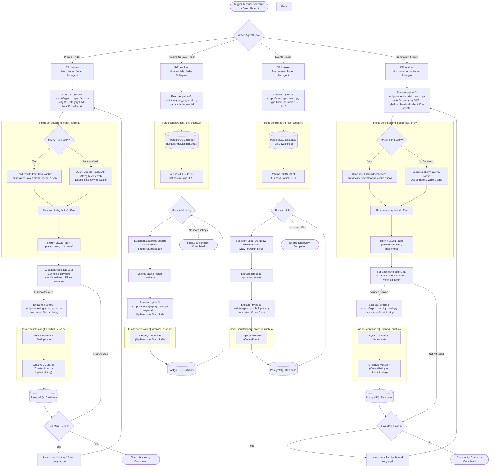

# Fina Native IDE Agent Architecture & Runbook

This reference document provides a comprehensive overview of the design, logic, and operational execution flow of the Fina Native IDE Agent pipeline. It details how the `fina_places_finder`, `fina_socials_finder`, `fina_events_finder`, and `fina_community_finder` subagents interact with the Google Places API and the Firebase SQL Connect database (hosted in the core `fina` repository) to automate discovery tasks without paid Gemini API keys.

---

## 📌 Orchestration Flow

Below is the high-level execution sequence of the native IDE agent workflow. The architecture leverages the Antigravity IDE's native subagents for data discovery, verification, enrichment, and pagination across 4 distinct, isolated pipelines.

---

## 🛠️ Essential Components & Mechanics

### 1. The `fina_places_finder` Subagent (Places Discovery)
This subagent automates business research on Google Maps:
*   **Discovery from Google Maps**: Specifically tuned to locate new candidate places using Google Places Text Search.
*   **Pagination & Context Preservation**: Places API can return dozens of candidates. To prevent bloating the subagent's prompt context, `scripts/agent_maps_fetch.py` chunks findings into pages of 10 (`--limit 10`). The subagent processes 10 items at a time and loops until `has_more` is false.
*   **Cost Optimization (Local Caching)**: To prevent redundant Places API costs during pagination loops, the fetch script stores all deduplicated candidates in a local cache file: `.antigravity_saves/maps_cache_{city}_{category}.json`. Pagination offsets are served instantly from the local cache. If fresh data is needed, passing `--refresh` forces a live Places API Text Search query.
*   **Offline/Mock Testing**: Bypasses the Places API if `GOOGLE_MAPS_API_KEY` is not set or is `"mock-key"`, returning realistic offline listing stubs for local testing.

### 2. The `fina_socials_finder` Subagent (Missing Socials Finder)
This subagent focuses purely on completing existing directory entries:
*   **Targeting**: Uses `agent_get_seeds.py --type missing-social` to query the database for existing listings that lack Facebook or Instagram URLs.
*   **Web Search**: Uses LLM-driven web search tools (with site-specific filtering) to find the business's official social media pages, verifies the match, and pushes updates via the `UpdateListingSocialUrls` mutation.

### 3. The `fina_events_finder` Subagent (Listing's Events Discoverer)
This subagent directly crawls the social pages of verified businesses to discover upcoming temporal events.
*   **Targeting**: Uses `agent_get_seeds.py --type business-socials --city C` to pull the social URLs of all verified listings in the specified city.
*   **Web Browsing**: Uses IDE native browser tools to scan those pages specifically for upcoming events.
*   **Pushing**: Creates new event records via the `CreateEvent` GraphQL mutation.

### 4. The `fina_community_finder` Subagent (Community Scanner)
This subagent actively searches Facebook and Instagram for Filipino community organisations:
*   **Search-First Workflow**: Executes `scripts/agent_social_search.py` to search for organizations in a city/category.
*   **Pagination & Caching**: Like the places finder, searches are cached in `.antigravity_saves/social_cache_{platform}_{city}_{category}.json` and served paginated (`--limit 10`).
*   **Browser Verification**: The subagent uses the `/browser` command to inspect candidate pages one-by-one, verifying authentic Filipino affiliation.
*   **Listing Persistence**: Verified organizations are pushed directly to the `Listing` table using `CreateListing`. For online-only communities (no physical street address), the address is set to the city name with city center coordinates and tagged with `online-community`.

### 5. Database Integration Scripts
To maintain security and ensure all data mutations pass through the authorized GraphQL layer, the subagents rely on local Python helper CLI scripts that connect to the core `fina` Firebase project:
*   `scripts/agent_get_seeds.py`: Fetches target source URLs, missing-social listings, or business-socials from the database.
*   `scripts/agent_graphql_push.py`: Pushes verified JSON objects or updates to the backend using GraphQL operations. Also synchronously handles geocoding and deduplication before creating new listings.
*   `scripts/agent_maps_fetch.py`: Searches Google Places (New) Text Search with caching and pagination.
*   `scripts/agent_social_search.py`: Searches Facebook/Instagram for community pages with caching and pagination.

### 6. Synchronous Geocoding & Deduplication
To simplify the architecture and reduce cloud function dependencies, heavy transactional logic is handled synchronously by `agent_graphql_push.py` before inserting data into the database:
*   **Geocoding**: Uses the Google Maps Geocoding API to resolve coordinates if missing prior to insertion.
*   **Deduplication**: Resolves matches using name normalization, `pgvector` semantic embedding similarity, and Jaccard word-overlap coefficient (>0.7). If a duplicate is found, it merges missing fields via `UpdateListingData` and `UpdateListingStatus` mutations instead of creating a new duplicate record.

---

## 💻 Operational Runbook

For instructions on how to trigger or schedule the `fina_places_finder`, `fina_socials_finder`, `fina_events_finder`, and `fina_community_finder` subagents, refer to the Operational Guide in the main repository `README.md`.
