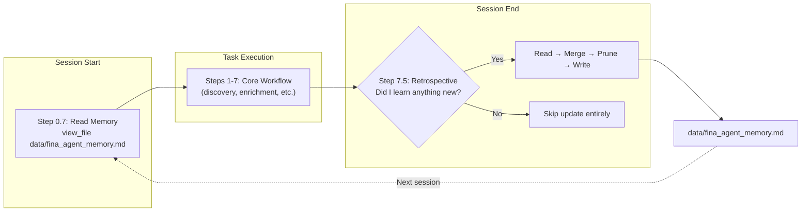

# Fina Native IDE Agent Architecture & Runbook

This reference document provides a comprehensive overview of the design, logic, and operational execution flow of the Fina Native IDE Agent pipeline. It details how the production agents (`fina_listing_web_search` and `fina_listing_enrichment`) interact with Google Maps, social platforms, and the Firebase SQL Connect database (hosted in the core `fina` repository) to automate discovery and enrichment tasks.

---

## 📌 Orchestration Flow

Below is the high-level execution sequence of the native IDE agent workflow. The architecture leverages the Antigravity IDE's native subagents for data discovery, verification, and enrichment.

```mermaid
flowchart TD
    Start(["Trigger: Manual /schedule or Direct Prompt"]) --> SelectSubagent{"Which Agent Flow?"}
    
    SelectSubagent -->|Listing Web Search| InvokeListingWebSearch["IDE Invokes fina_listing_web_search Subagent"]
    SelectSubagent -->|Listing Enrichment| InvokeListingEnrichment["IDE Invokes fina_listing_enrichment Subagent"]

    %% ════════ 1. LISTING WEB SEARCH FLOW ════════
    InvokeListingWebSearch --> ReadMemoryWS["Read data/fina_agent_memory.md"]
    ReadMemoryWS --> GenerateTasks["Execute: python3 scripts/agent_web_search_tasks.py<br>--action generate --city C (idempotent)"]
    GenerateTasks --> GetNextTask["Execute: python3 scripts/agent_web_search_tasks.py<br>--action next --city C"]
    GetNextTask --> FetchCityListings["Execute: python3 scripts/agent_fetch_targets.py --type city-listings<br>--city C > tmp/existing_city_listings.json"]
    FetchCityListings --> NativeWebSearch["Subagent uses Native Web Search<br>(4 rounds: Facebook, Instagram, General Web, Google Maps)<br>using task's formatted_query"]
    NativeWebSearch --> FilterKnown["Filters out existing URLs/Names by<br>inspecting tmp/existing_city_listings.json on disk"]
    
    FilterKnown --> BrowserVerify["For each NEW candidate URL:<br>Subagent uses chrome-devtools to inspect page<br>(visible text/selectors only)"]
    BrowserVerify -->|Verified Filipino| MapsEnrich["Google Maps Enrichment<br>(lat/lng, address, hours, phone)"]
    MapsEnrich --> ExecPushListing["Execute: python3 scripts/agent_graphql_push.py<br>--operation CreateListing"]
    subgraph agent_graphql_push_listing["Inside scripts/agent_graphql_push.py"]
        SyncGeocodeDedupListing["Sync Geocode & Deduplicate"]
        GQLMutationListing["GraphQL Mutation<br>(CreateListing or UpdateListing)"]
    end
    ExecPushListing --> SyncGeocodeDedupListing
    SyncGeocodeDedupListing --> GQLMutationListing
    GQLMutationListing --> DBTransactionListing[("PostgreSQL Database")]
    
    DBTransactionListing --> CheckHasMoreSocial
    BrowserVerify -->|Not Affiliated| CheckHasMoreSocial
    
    CheckHasMoreSocial{"Found 30 new listings<br>OR finished all rounds?"}
    CheckHasMoreSocial -->|No| NativeWebSearch
    CheckHasMoreSocial -->|Yes| CompleteTask["Execute: python3 scripts/agent_web_search_tasks.py<br>--action complete --task-id ID"]
    CompleteTask --> RetroWS["Post-Execution Retrospective<br>(Update fina_agent_memory.md if new insights)"]
    RetroWS --> FinishSocial(["Task Completed — Agent Stops"])

    %% ════════ 2. LISTING ENRICHMENT FLOW ════════
    InvokeListingEnrichment --> ReadMemoryE["Read data/fina_agent_memory.md"]
    ReadMemoryE --> GenerateEnrichTasks["Execute: python3 scripts/agent_enrichment_tasks.py<br>--action generate --city C (idempotent)"]
    GenerateEnrichTasks --> GetNextEnrichTask["Execute: python3 scripts/agent_enrichment_tasks.py<br>--action next --city C"]
    GetNextEnrichTask --> ExtractReviews["Extract reviews in 3 rounds:<br>(a) Google Maps browser<br>(b) Social media pages<br>(c) Web search"]
    ExtractReviews --> PushReviews["Execute: python3 scripts/agent_graphql_push.py<br>--operation CreateReview (per review)"]
    PushReviews --> SynthesiseDesc["Synthesise AuE description<br>(150-250 words)"]
    SynthesiseDesc --> PushEnrichment["Execute: python3 scripts/agent_graphql_push.py<br>--operation UpdateListingData"]
    PushEnrichment --> DBTransactionEnrich[("PostgreSQL Database")]
    DBTransactionEnrich --> CompleteEnrichTask["Execute: python3 scripts/agent_enrichment_tasks.py<br>--action complete --task-id ID"]
    CompleteEnrichTask --> RetroE["Post-Execution Retrospective<br>(Update fina_agent_memory.md if new insights)"]
    RetroE --> FinishEnrich(["Task Completed — Agent Stops"])
```



---

## 🛠️ Essential Components & Mechanics

### 1. The `fina_listing_web_search` Subagent (Community Scanner)
This subagent actively searches Facebook, Instagram, TikTok, general web platforms, and Google Maps for Filipino listings using a deterministic task-based state machine:
*   **Task-Based Execution**: Each run is scoped to a single task (1 location × 1 category × 1 search template) with a limit of 30 new listings. Tasks are managed via `scripts/agent_web_search_tasks.py`, which generates all permutations for a city (`data/listing_web_search_tasks_{city}.json`) and provides `next`/`complete` actions for state transitions (PENDING → IN_PROGRESS → COMPLETED). Categories with `"cityOnly": true` in `data/categories.json` (e.g. `GOVERNMENT`) produce only city-level tasks, skipping suburb permutations. By default, generation skips if the file already exists; pass `--force` to regenerate while merging existing task state (status, metrics) into the new file via atomic replacement. Stale `IN_PROGRESS` tasks (exceeding `--stale-timeout-minutes`, default 60) are automatically reclaimed to `PENDING` during `--action next`.
*   **Context Setup (No-Bloat)**: Executes `scripts/agent_fetch_targets.py --type city-listings --city C > tmp/existing_city_listings.json` to write the deduplication context directly to disk. The agent checks if a candidate exists by searching the file directly on disk, avoiding terminal stdout dumps.
*   **Web Discovery**: Uses the task's pre-formatted search query to run four sequential search rounds (Facebook, Instagram, General Web, and Google Maps browser). Each task's query is pre-generated from the `searchTemplates` in `data/categories.json` combined with the location (city or suburb from `data/top_suburbs_per_city.json`).
*   **Browser Verification (No-Bloat)**: The subagent uses the `chrome-devtools` skill to inspect candidate pages, extracting only visible text or target DOM selectors (such as the follower count element or the bio description), rather than loading full raw page HTML into prompt history.
*   **Category Standardization**: The subagent is instructed to view [categories.json](file:///Users/ryan/.gemini/antigravity/scratch/fina-agent/data/categories.json) to ensure extracted categories map precisely to canonical definitions before pushing.
*   **Google Maps Enrichment**: Navigates to Google Maps via Chrome DevTools to enrich verified candidates with latitude/longitude (parsed from URL bar), address, opening hours, phone, Place ID, and website — filling only empty fields. Adds a `google-maps` tag when enrichment succeeds. Proceeds to push regardless of Maps enrichment outcome.
*   **Listing Persistence**: Verified organizations are pushed directly to the `Listing` table using `CreateListing`. For online-only communities (no physical street address), the address is set to the city name with city center coordinates and tagged with `online-org`.
*   **Omission of Embeddings Flag**: Does NOT use the `--generate-embeddings` flag when pushing listings via the GraphQL client.

### 2. The `fina_listing_enrichment` Subagent (Listing Enricher)
This subagent enriches existing listings by extracting reviews, synthesising descriptions, and filling missing data:
*   **Task-Based Execution**: Each run is scoped to a single listing. Tasks are managed via `scripts/agent_enrichment_tasks.py`, which generates one task per listing (`data/listing_enrichment_tasks_{city}.json`) and provides `next`/`complete` actions for state transitions. Pass `--force` to regenerate while merging existing task state.
*   **Review Extraction**: Three sequential rounds: (a) Google Maps browser — reviews, operating hours, social links; (b) Social media — testimonials, follower counts from existing Facebook/Instagram/TikTok pages; (c) Web search — `"<name>" <city> reviews` across up to 5 pages.
*   **Description Synthesis**: Generates a 150-250 word description in Australian English (AuE) combining extracted reviews with the listing's existing description.
*   **Data Push**: Reviews pushed individually via `CreateReview` (idempotent via `externalSourceId`). Enriched data pushed via `UpdateListingData` — description, operating hours (always overwritten), social URLs/follower counts (only filling previously-null fields).

### Planned Agents (Not Yet Released)

The following agents exist as skills/scripts but are not yet production-ready:

| Agent | Purpose | Key Component |
|---|---|---|
| `fina_listing_map_search` | Google Places API discovery via task-based state machine | `scripts/agent_maps_search_tasks.py`, `scripts/agent_maps_fetch.py` |
| `fina_listing_embedder` | Vector embedding backfill for semantic search | `scripts/agent_generate_embeddings.py` |
| `fina_events_finder` | Social media event scraping from verified businesses | `scripts/agent_fetch_targets.py --type business-socials` |
| `fina_docs_reviewer` | Documentation audit against codebase | Controlled at agent level |

### 3. Database Integration Scripts
To maintain security and ensure all data mutations pass through the authorized GraphQL layer, the subagents rely on local Python helper CLI scripts that connect to the core `fina` Firebase project:
*   `scripts/agent_fetch_targets.py`: Fetches target source URLs, missing-social listings, business-socials, city-listings (for deduplication context), or social-post-trackers from the database.
*   `scripts/agent_graphql_push.py`: Pushes verified JSON objects or updates to the backend using GraphQL operations (including `CreateListing`, `UpdateListingData`, `UpdateListingSocialUrls`, `CreateReview`, `CreateEvent`, and `UpsertSocialPostTracker`). It normalizes platform names, dynamically validates and normalizes categories against [categories.json](file:///Users/ryan/.gemini/antigravity/scratch/fina-agent/data/categories.json), caches loaded categories in module scope, and synchronously handles geocoding and deduplication before creating new listings.
*   `scripts/agent_check_duplicate.py`: Checks a local JSON file of existing listings for duplicate candidates by name and/or social URL match.
*   `scripts/agent_web_search_tasks.py`: Manages the task-based state machine for `fina_listing_web_search` (`generate`, `next`, `complete`, `summary`).
*   `scripts/agent_enrichment_tasks.py`: Manages the task-based state machine for `fina_listing_enrichment` (`generate`, `next`, `complete`, `summary`).

### 4. Synchronous Geocoding & Deduplication
To simplify the architecture and reduce cloud function dependencies, heavy transactional logic is handled synchronously by `agent_graphql_push.py` before inserting data into the database:
*   **Geocoding**: Uses the Google Maps Geocoding API to resolve coordinates if missing prior to insertion.
*   **Deduplication**: Resolves matches using name normalization, `pgvector` semantic embedding similarity, and Jaccard word-overlap coefficient (>0.7). If a duplicate is found, it merges missing fields via `UpdateListingData` and `UpdateListingStatus` mutations instead of creating a new duplicate record.

---

## 🧠 Shared Agent Memory

### Overview

The Fina agent pipeline uses a shared, self-evolving memory system that enables agents to learn from their executions and share operational knowledge across sessions. This addresses the fundamental limitation of stateless agent invocations: without persistent memory, agents repeat the same mistakes, rediscover the same patterns, and waste tokens re-learning platform behaviours.

The memory is stored in a single markdown file — [`data/fina_agent_memory.md`](file:///Users/ryan/.gemini/antigravity/scratch/fina-agent/data/fina_agent_memory.md) — that agents read at session start and conditionally update at session end.

### Design Philosophy

The framework is built on five core principles, each drawn from research into leading agent memory architectures:

| Principle | Origin | Implementation |
|---|---|---|
| **Bounded curation** | [Hermes](https://arxiv.org/abs/2310.00710) (~800 token active memory) | 200-line hard budget forces agents to prioritise quality over quantity |
| **Post-execution reflection** | [OpenClaw](https://arxiv.org/abs/2401.13178) (dreaming pipeline) | Structured retrospective step after every task completion |
| **Self-managing memory** | [MemGPT/Letta](https://arxiv.org/abs/2310.08560) (agents edit their own memory) | Agents read, merge, prune, and write back the memory file autonomously |
| **Quality-gated learning** | [Reflexion](https://arxiv.org/abs/2303.11366) (execute → reflect → crystallise) | Explicit "did I learn anything new?" gate prevents noise accumulation |
| **Semantic taxonomy** | [CoALA](https://arxiv.org/abs/2309.02427) (memory type classification) | Five named sections map to distinct knowledge domains |

**What was deliberately not adopted:**
- **OpenClaw's daily log rotation** — Fina agents run as single-task sessions, not daemons
- **MemGPT's multi-tier storage** — Overkill for a single markdown file with 200-line budget
- **Hermes' skill crystallisation** — Agent skills are manually curated SKILL.md files, not auto-generated
- **Vector-indexed episodic memory** — The 200-line cap makes full-text reading cheaper than semantic retrieval

### Architecture



The memory protocol integrates into the agent lifecycle as two lightweight steps that bookend the core workflow:

1. **Read Phase (Step 0.7)** — After environment setup but before task execution, the agent reads the memory file and internalises relevant insights for the upcoming task.
2. **Retrospective Phase (Step 7.5)** — After task completion but before stopping, the agent evaluates whether the execution surfaced genuinely new operational knowledge.

### File Schema

The memory file has a fixed five-section structure, each serving a distinct knowledge domain:

```markdown
# Fina Agent Memory

> Self-evolving shared memory for Fina discovery and enrichment agents.
> Maximum budget: **200 lines**.
> Supersession rule: new insights replace contradictory old entries.
> Format: concise bullet points (one line per insight). No prose paragraphs.

## Platform & Browser Insights
<!-- Anti-bot patterns, UI changes, rate limits, login walls -->

## Discovery Patterns
<!-- Search techniques, template effectiveness, duplicate trends -->

## Enrichment Patterns
<!-- Review extraction, hours parsing, social media quirks -->

## City Intelligence
<!-- Suburb saturation, high-yield categories, city-specific observations -->

## Known Pitfalls
<!-- Validation errors, payload patterns, failure recovery -->
```

**Section responsibilities:**

| Section | Written by | Example entries |
|---|---|---|
| Platform & Browser Insights | Both agents | "Facebook requires login to view follower counts as of 2026-06" |
| Discovery Patterns | `fina_listing_web_search` | "RESTAURANT category in Sydney CBD yields >80% duplicates — consider skipping" |
| Enrichment Patterns | `fina_listing_enrichment` | "Google Maps reviews section now uses `div[data-review-id]` selector" |
| City Intelligence | Both agents | "Melbourne: Dandenong and Footscray are highest-density Filipino suburbs" |
| Known Pitfalls | Both agents | "`CreateListing` rejects `openingHours` with trailing whitespace in day names" |

### Budget Management

The memory file enforces a **200-line hard cap** (including headers, section headings, and blockquote rules). This constraint is deliberate:

- **Forces curation**: Agents must evaluate what's truly worth retaining versus what's transient noise.
- **Prevents context bloat**: At ~200 lines, the entire file fits comfortably within a single `view_file` call, keeping the read phase cheap.
- **Drives supersession**: When new insights contradict existing entries, agents replace the old entry rather than appending both.

**Pruning heuristics** (applied by agents when the file approaches the budget):

1. **Staleness**: Remove entries about platform behaviours that have since changed (superseded).
2. **Redundancy**: Merge entries that describe the same insight from different angles.
3. **Specificity**: Prefer specific, actionable entries over vague observations.
4. **Frequency**: Entries that apply to every execution are more valuable than edge cases.

### Entry Format

All entries must follow these formatting rules:

- **One bullet point per insight** — keeps entries atomic and individually pruneable.
- **No prose paragraphs** — agents write concise, scannable entries.
- **Include dates when relevant** — for time-sensitive platform behaviours (e.g., "as of 2026-06").
- **Include scope when relevant** — for city/category-specific patterns (e.g., "Sydney RESTAURANT").

### Concurrency Model

The current implementation uses a **last-writer-wins** strategy:

- Multiple concurrent agents may read the memory file simultaneously (no conflict).
- If two agents both decide to write at the same time, the last write overwrites the first.
- This is acceptable because:
  1. The quality gate means most executions skip the write entirely.
  2. When writes do occur, they're typically to different sections.
  3. Git history preserves any overwritten content for manual recovery.
  4. The cost of `fcntl` locking for a rarely-written markdown file exceeds the benefit.

**Known limitation**: In a theoretical worst case, two concurrent agents could both surface valuable insights, and the second writer could overwrite the first's contribution. The mitigation is that agents run as single-task sessions and the retrospective happens at session end, making true write contention rare.

### Participating Agents

The memory protocol is currently implemented for the 2 production-ready agents:

| Agent | Read Step | Retro Step | Typical insights |
|---|---|---|---|
| `fina_listing_web_search` | Step 0.7 | Step 7.5 | Search template effectiveness, platform rate limits, suburb saturation |
| `fina_listing_enrichment` | Step 0.7 | Step 7.5 | Maps UI selectors, review extraction techniques, hours parsing edge cases |

Planned agents (`fina_listing_map_search`, `fina_events_finder`, `fina_listing_embedder`) are not yet released but can be onboarded by adding the same Step 0.7/7.5 pattern to their SKILL.md files.

### Governing Rule

The memory protocol is enforced by **Rule 1.15: Shared Agent Memory Protocol** in [AGENTS.md](file:///Users/ryan/.gemini/antigravity/scratch/fina-agent/AGENTS.md), which establishes the read/retro lifecycle, budget invariant, supersession rule, and content invariant as architectural constraints.

### Version History & Recovery

The memory file is Git-tracked (it lives in `data/`), providing automatic version history. If an agent's write is destructive or incorrect:

```bash
# View memory file evolution
git log --oneline data/fina_agent_memory.md

# Recover a previous version
git show HEAD~1:data/fina_agent_memory.md
```

This makes Git the de-facto "episodic memory" layer — the live file is working memory, and Git history is long-term recall.

---

## 💻 Operational Runbook

For instructions on how to trigger or schedule the `fina_listing_web_search` and `fina_listing_enrichment` agents, refer to the Operational Guide in the main repository `README.md`.

