# Fina Native IDE Agent Architecture & Runbook

This reference document provides a comprehensive overview of the design, logic, and operational execution flow of the Fina Native IDE Agent pipeline. It details how the `fina_refresh_listing_maps_finder`, `fina_enrich_listing_socials_finder`, `fina_events_finder`, and `fina_new_listing_web_finder` subagents interact with the Google Places API and the Firebase SQL Connect database (hosted in the core `fina` repository) to automate discovery tasks without paid Gemini API keys.

---

## 📌 Orchestration Flow

Below is the high-level execution sequence of the native IDE agent workflow. The architecture leverages the Antigravity IDE's native subagents for data discovery, verification, enrichment, and pagination across 4 distinct, isolated pipelines.

```mermaid
flowchart TD
    %% ─── SCHEDULE OR MANUAL INVOCATION ───
    Start(["Trigger: Manual /schedule or Direct Prompt"]) --> SelectSubagent{"Which Agent Flow?"}
    
    %% ════════ 1. PLACES FINDER FLOW (PLACES) ════════
    SelectSubagent -->|Refresh Listing Maps Finder| InvokeRefreshListingMapsFinder["IDE Invokes fina_refresh_listing_maps_finder Subagent"]
    SelectSubagent -->|Listing Auditor| InvokeListingAuditor["IDE Invokes fina_listing_auditor Subagent"]
    SelectSubagent -->|Docs Reviewer| InvokeDocsReviewer["IDE Invokes fina_docs_reviewer Subagent"]
    InvokeRefreshListingMapsFinder --> ExecMapsFetch["Execute: python3 scripts/agent_maps_fetch.py<br>--city C --category CAT --limit 10 --offset O"]
    
    subgraph agent_maps_fetch["Inside scripts/agent_maps_fetch.py"]
        CheckCache{"Cache File Exists?"}
        ReadCache["Read results from local cache:<br>.antigravity_saves/maps_cache_*.json"]
        QueryPlaces["Query Google Places API (New) Text Search<br>Deduplicate & Write Cache"]
        SliceResults["Slice results by limit & offset"]
        ReturnPage["Return JSON Page (places, total, has_more)"]
    end
    
    ExecMapsFetch --> CheckCache
    CheckCache -->|Yes| ReadCache
    CheckCache -->|No / --refresh| QueryPlaces
    ReadCache --> SliceResults
    QueryPlaces --> SliceResults
    SliceResults --> ReturnPage
    
    ReturnPage --> VerifyHeuristic["Subagent uses IDE LLM Context & Reviews<br>to verify authentic Filipino affiliation"]
    
    VerifyHeuristic -->|Filipino Affiliated| ExecPushDataMaps["Execute: python3 scripts/agent_graphql_push.py<br>--operation CreateListing"]
    subgraph agent_graphql_push_maps["Inside scripts/agent_graphql_push.py"]
        SyncGeocodeDedupMaps["Sync Geocode & Deduplicate"]
        GQLMutationMaps["GraphQL Mutation<br>(CreateListing or UpdateListing)"]
    end
    ExecPushDataMaps --> SyncGeocodeDedupMaps
    SyncGeocodeDedupMaps --> GQLMutationMaps
    GQLMutationMaps --> DBTransactionMaps[("PostgreSQL Database")]
    
    DBTransactionMaps --> CheckHasMore
    
    VerifyHeuristic -->|Not Affiliated| CheckHasMore
    
    CheckHasMore{"Has More Pages?"}
    CheckHasMore -->|Yes| NextPage["Increment offset by 10 and query again"]
    NextPage --> ExecMapsFetch
    CheckHasMore -->|No| FinishMaps(["Maps Refresh/Discovery Completed"])
Base
    %% ════════ 2. MISSING SOCIALS FINDER FLOW (BACKFILL) ════════
    SelectSubagent -->|Enrich Listing Socials Finder| InvokeEnrichListingSocialsFinder["IDE Invokes fina_enrich_listing_socials_finder Subagent"]
    InvokeEnrichListingSocialsFinder --> ExecGetMissingSocial["Execute: python3 scripts/agent_fetch_targets.py<br>--type missing-social"]
    
    subgraph agent_fetch_missing_social["Inside scripts/agent_fetch_targets.py"]
        DBQueryMissingSocial[("PostgreSQL Database<br>(ListListingsMissingSocial)")]
        ReturnMissingSocial["Returns JSON list of Listings missing URLs"]
    end
    
    ExecGetMissingSocial --> DBQueryMissingSocial
    DBQueryMissingSocial -.-> ReturnMissingSocial
    
    ReturnMissingSocial --> EnrichLoop{"For each Listing"}
    EnrichLoop --> SearchWeb["Subagent uses web search<br>Finds official Facebook/Instagram"]
    SearchWeb --> VerifySocial["Verifies pages match business"]
    
    VerifySocial --> ExecUpdateSocial["Execute: python3 scripts/agent_graphql_push.py<br>--operation UpdateListingSocialUrls"]
    subgraph agent_graphql_push_update["Inside scripts/agent_graphql_push.py"]
        GQLMutationUpdate["GraphQL Mutation<br>(UpdateListingSocialUrls)"]
    end
    
    ExecUpdateSocial --> GQLMutationUpdate
    GQLMutationUpdate --> DBTransactionUpdate[("PostgreSQL Database")]
    DBTransactionUpdate --> EnrichLoop
    
    EnrichLoop -.->|No more listings| FinishEnrich(["Socials Enrichment Completed"])
    
    %% ════════ 3. EVENTS FINDER FLOW (BUSINESS PAGES) ════════
    SelectSubagent -->|Events Finder| InvokeEventsFinder["IDE Invokes fina_events_finder Subagent"]
    InvokeEventsFinder --> ExecGetBusinessSocial["Execute: python3 scripts/agent_fetch_targets.py<br>--type business-socials --city C"]
    
    subgraph agent_fetch_business_social["Inside scripts/agent_fetch_targets.py"]
        DBQueryBusinessSocial[("PostgreSQL Database<br>(ListCityListings)")]
        ReturnBusinessSocial["Returns JSON list of Business Social URLs"]
    end
    
    ExecGetBusinessSocial --> DBQueryBusinessSocial
    DBQueryBusinessSocial -.-> ReturnBusinessSocial
    
    ReturnBusinessSocial --> HarvestLoop{"For each URL"}
    HarvestLoop --> IdentifyPlatform["Identify Platform & Query Tracker:<br>python3 scripts/agent_fetch_targets.py --type social-post-tracker"]
    IdentifyPlatform --> GetTrackerGQL["GraphQL Query:<br>GetSocialPostTracker"]
    GetTrackerGQL --> DBQueryTracker[("PostgreSQL Database")]
    DBQueryTracker -.-> ReturnTracker["Return lastPostDate"]
    
    ReturnTracker --> ReadBrowserHarvest["Subagent uses IDE Native Browser Tools<br>(visit, scroll)"]
    ReadBrowserHarvest --> ScanLoop{"Scan posts (max 10)<br>Stop if post date <= lastPostDate"}
    ScanLoop --> ExtractEventData["Extract events & follower count"]
    
    ExtractEventData --> ExecPushEvent["Execute: python3 scripts/agent_graphql_push.py<br>--operation CreateEvent"]
    ExtractEventData --> ExecPushFollowers["Execute: python3 scripts/agent_graphql_push.py<br>--operation UpdateListingSocialUrls"]
    ExtractEventData --> ExecPushTracker["Execute: python3 scripts/agent_graphql_push.py<br>--operation UpsertSocialPostTracker"]
    
    subgraph agent_graphql_push_event["Inside scripts/agent_graphql_push.py"]
        GQLMutationEvent["GraphQL Mutation<br>(CreateEvent)"]
        GQLMutationFollowers["GraphQL Mutation<br>(UpdateListingSocialUrls)"]
        GQLMutationTracker["GraphQL Mutation<br>(UpsertSocialPostTracker)"]
    end
    
    ExecPushEvent --> GQLMutationEvent
    ExecPushFollowers --> GQLMutationFollowers
    ExecPushTracker --> GQLMutationTracker
    
    GQLMutationEvent & GQLMutationFollowers & GQLMutationTracker --> DBTransactionEvent[("PostgreSQL Database")]
    DBTransactionEvent --> HarvestLoop
    
    HarvestLoop -.->|No more URLs| FinishHarvest(["Events Discovery Completed"])
    
    %% ════════ 4. COMMUNITY FINDER FLOW (SOCIAL) ════════
    SelectSubagent -->|New Listing Web Finder| InvokeNewListingWebFinder["IDE Invokes fina_new_listing_web_finder Subagent"]
    InvokeNewListingWebFinder --> FetchCityListings["Execute: python3 scripts/agent_fetch_targets.py<br>--type city-listings --city C"]
    FetchCityListings --> NativeWebSearch["Subagent uses Native Web Search<br>(e.g., Google site:facebook.com)"]
    NativeWebSearch --> FilterKnown["Filters out existing URLs/Names<br>from city-listings context"]
    
    FilterKnown --> BrowserVerify["For each NEW candidate URL:<br>Subagent uses chrome-devtools to verify affiliation"]
    BrowserVerify -->|Verified Filipino| ExecPushListing["Execute: python3 scripts/agent_graphql_push.py<br>--operation CreateListing"]
    subgraph agent_graphql_push_listing["Inside scripts/agent_graphql_push.py"]
        SyncGeocodeDedupListing["Sync Geocode & Deduplicate"]
        GQLMutationListing["GraphQL Mutation<br>(CreateListing or UpdateListing)"]
    end
    ExecPushListing --> SyncGeocodeDedupListing
    SyncGeocodeDedupListing --> GQLMutationListing
    GQLMutationListing --> DBTransactionListing[("PostgreSQL Database")]
    
    DBTransactionListing --> CheckHasMoreSocial
    BrowserVerify -->|Not Affiliated| CheckHasMoreSocial
    
    CheckHasMoreSocial{"Found 10 new listings<br>OR checked 10 pages?"}
    CheckHasMoreSocial -->|No| NativeWebSearch
    CheckHasMoreSocial -->|Yes| FinishSocial(["Web Discovery Completed"])

    %% ════════ 5. LISTING AUDITOR FLOW (CATEGORY AUDIT) ════════
    InvokeListingAuditor --> ExecAudit["Execute: python3 scripts/agent_audit_listings.py<br>--city C --limit 10 --offset O"]
    
    subgraph agent_audit_listings["Inside scripts/agent_audit_listings.py"]
        QueryCityListings["GraphQL Query: ListCityListings"]
        QueryCityListings --> DBCityListings[("PostgreSQL Database")]
        DBCityListings -.-> ReturnAuditPage["Return JSON Page (listings, total, has_more)"]
    end
    
    ExecAudit --> QueryCityListings
    ReturnAuditPage --> VerifyAuditHeuristic["Subagent checks listing categories<br>against data/categories.json"]
    
    VerifyAuditHeuristic -->|Needs Corrections & Not Dry-Run| ExecPushAudit["Execute: python3 scripts/agent_graphql_push.py<br>--operation UpdateListingData"]
    subgraph agent_graphql_push_audit["Inside scripts/agent_graphql_push.py"]
        GQLMutationAudit["GraphQL Mutation<br>(UpdateListingData)"]
    end
    ExecPushAudit --> GQLMutationAudit
    GQLMutationAudit --> DBTransactionAudit[("PostgreSQL Database")]
    
    DBTransactionAudit --> CheckHasMoreAudit
    VerifyAuditHeuristic -->|No corrections OR Dry-Run| CheckHasMoreAudit
    
    CheckHasMoreAudit{"Has More Listings?"}
    CheckHasMoreAudit -->|Yes| NextPageAudit["Increment offset by 10 and query again"]
    NextPageAudit --> ExecAudit
    CheckHasMoreAudit -->|No| FinishAudit(["Audit Completed"])

    %% ════════ 6. DOCUMENTATION REVIEWER FLOW (DOCS AUDIT) ════════
    InvokeDocsReviewer --> VerifyDocs["Subagent audits documentation against codebase"]
    VerifyDocs -->|Discrepancies Found| UpdateDocs["Update Markdown Files"]
    VerifyDocs -->|Report Generation| WriteDocReport["Write report to logs/"]
    UpdateDocs & WriteDocReport --> FinishDocs(["Docs Audit Completed"])
```

---

## 🛠️ Essential Components & Mechanics

### 1. The `fina_refresh_listing_maps_finder` Subagent (Places Discovery)
This subagent automates business research on Google Maps:
*   **Discovery from Google Maps**: Specifically tuned to locate new candidate places using Google Places Text Search.
*   **Category Validation**: To ensure alignment with [categories.json](file:///Users/ryan/.gemini/antigravity/scratch/fina-agent/data/categories.json), the subagent is instructed to read the canonical category rules at startup. Furthermore, the `--category` argument choices in `scripts/agent_maps_fetch.py` are dynamically loaded from the keys defined in the category specification file.
*   **Pagination & Context Preservation**: Places API can return dozens of candidates. To prevent bloating the subagent's prompt context, `scripts/agent_maps_fetch.py` chunks findings into pages of 10 (`--limit 10`). The subagent processes 10 items at a time and loops until `has_more` is false.
*   **Cost Optimization (Local Caching)**: To prevent redundant Places API costs during pagination loops, the fetch script stores all deduplicated candidates in a local cache file: `.antigravity_saves/maps_cache_{city}_{category}.json`. Pagination offsets are served instantly from the local cache. If fresh data is needed, passing `--refresh` forces a live Places API Text Search query.
*   **Offline/Mock Testing**: Bypasses the Places API if `GOOGLE_MAPS_API_KEY` is not set or is `"mock-key"`, returning realistic offline listing stubs for local testing.

### 2. The `fina_enrich_listing_socials_finder` Subagent (Missing Socials Finder)
This subagent focuses purely on completing existing directory entries:
*   **Targeting**: Uses `agent_fetch_targets.py --type missing-social` to query the database for existing listings that lack Facebook or Instagram URLs.
*   **Web Search**: Uses LLM-driven web search tools (with site-specific filtering) to find the business's official social media pages, verifies the match, and pushes updates via the `UpdateListingSocialUrls` mutation.

### 3. The `fina_events_finder` Subagent (Listing's Events Discoverer)
This subagent directly crawls the social pages of verified businesses to discover upcoming temporal events, checking for new posts since the last scan date.
*   **Targeting**: Uses `agent_fetch_targets.py --type business-socials --city C` to pull the social URLs of all verified listings in the specified city.
*   **Bookmark Tracking**: Before scanning, it queries the database via `agent_fetch_targets.py --type social-post-tracker --listing-id L --platform P` to retrieve the `lastPostDate` (bookmark of the most recent post scanned in the previous run).
*   **Web Browsing & Scanning Limit**: Uses IDE native browser tools (e.g. Chrome DevTools) to visit the social account page. It scans posts starting from the most recent, moving backward. It stops scanning as soon as:
    1. A post's publish date is older than or equal to the retrieved `lastPostDate` (if any).
    2. OR it has evaluated exactly 10 posts on the page.
*   **Follower Extraction**: In addition to events, it extracts the current follower counts from the page.
*   **GraphQL Updates & Bookmark Upserting**: For each listing processed:
    1. Upcoming events are pushed via the `CreateEvent` GraphQL mutation.
    2. Follower counts are pushed via the `UpdateListingSocialUrls` GraphQL mutation.
    3. The newest scanned post timestamp is saved as the new bookmark by calling `agent_graphql_push.py --operation UpsertSocialPostTracker --variables '<variables>'` (which upserts the tracking entry in the `SocialPostTracker` table).

### 4. The `fina_new_listing_web_finder` Subagent (Community Scanner)
This subagent actively searches Facebook and Instagram for Filipino community organisations:
*   **Context Setup**: Executes `scripts/agent_fetch_targets.py --type city-listings --city C` to load existing listings for deduplication.
*   **Web Discovery**: Uses the native web search tool (e.g., Google Search with `site:facebook.com` filters) to discover new candidates directly, skipping any already known in the database context.
*   **Browser Verification**: The subagent uses the `chrome-devtools` skill to inspect candidate pages one-by-one, verifying authentic Filipino affiliation.
*   **Category Standardization**: The subagent is instructed to view [categories.json](file:///Users/ryan/.gemini/antigravity/scratch/fina-agent/data/categories.json) at the beginning of its run to ensure extracted categories map precisely to canonical definitions before pushing.
*   **Listing Persistence**: Verified organizations are pushed directly to the `Listing` table using `CreateListing`. For online-only communities (no physical street address), the address is set to the city name with city center coordinates and tagged with `online-community`.

### 5. The `fina_listing_auditor` Subagent (Category Auditor)
This subagent audits listing category assignments to ensure they conform to canonical definition specs:
*   **Evaluation against definitions**: Compares existing listing data (name, description, tags, current categories) against rules in `data/categories.json`.
*   **LLM Validation**: Uses Gemini LLM structured JSON output schema validation to determine if category corrections are needed.
*   **Recategorization**: Performs recategorizations using the `UpdateListingData` mutation.
*   **Run Report Consolidation**: Formats and writes run reports under `logs/` directory, merging sequential pagination runs into a single consolidated log.

### 6. The `fina_docs_reviewer` Subagent (Documentation Reviewer)
This subagent audits repository documentation against actual Python script definitions:
*   **CLI Verification**: Reviews CLI usages, options, and parameters in documentation against source arguments (e.g. confirming no outdated parameters like `--dry-run` are passed directly to script commands).
*   **Agent Flow Auditing**: Verifies that new agent skills, registries, and architecture diagrams match active implementations.
*   **Audit Report Generation**: Saves documentation reviews and gap logs in markdown report files under the `logs/` directory.

### 7. Database Integration Scripts
To maintain security and ensure all data mutations pass through the authorized GraphQL layer, the subagents rely on local Python helper CLI scripts that connect to the core `fina` Firebase project:
*   `scripts/agent_fetch_targets.py`: Fetches target source URLs, missing-social listings, business-socials, city-listings (for deduplication context), or social-post-trackers (for checking previous event scraper bookmarks) from the database.
*   `scripts/agent_graphql_push.py`: Pushes verified JSON objects or updates to the backend using GraphQL operations (including `CreateListing`, `UpdateListingSocialUrls`, `CreateEvent`, and `UpsertSocialPostTracker`). It normalizes platform names, dynamically validates and normalizes categories against [categories.json](file:///Users/ryan/.gemini/antigravity/scratch/fina-agent/data/categories.json) (enforcing case-insensitive uppercase normalization and throwing a fatal exit code 1 if invalid), caches loaded categories in module scope to prevent redundant disk reads, and synchronously handles geocoding and deduplication before creating new listings.
*   `scripts/agent_maps_fetch.py`: Searches Google Places (New) Text Search with caching and pagination.
*   `scripts/agent_audit_listings.py`: Evaluates, validates, and recategorizes business categories against canonical JSON specs.

### 8. Synchronous Geocoding & Deduplication
To simplify the architecture and reduce cloud function dependencies, heavy transactional logic is handled synchronously by `agent_graphql_push.py` before inserting data into the database:
*   **Geocoding**: Uses the Google Maps Geocoding API to resolve coordinates if missing prior to insertion.
*   **Deduplication**: Resolves matches using name normalization, `pgvector` semantic embedding similarity, and Jaccard word-overlap coefficient (>0.7). If a duplicate is found, it merges missing fields via `UpdateListingData` and `UpdateListingStatus` mutations instead of creating a new duplicate record.

---

## 💻 Operational Runbook

For instructions on how to trigger or schedule the `fina_refresh_listing_maps_finder`, `fina_enrich_listing_socials_finder`, `fina_events_finder`, `fina_new_listing_web_finder`, and `fina_listing_auditor` subagents, refer to the Operational Guide in the main repository `README.md`.
