# Fina Native IDE Agent Architecture & Runbook

This reference document provides a comprehensive overview of the design, logic, and operational execution flow of the Fina Native IDE Agent pipeline. It details how the `fina_refresh_listing_maps_finder`, `fina_new_listing_web_finder`, `fina_enrich_listing_socials_finder`, `fina_listing_embedder`, `fina_events_finder`, and `fina_docs_reviewer` subagents interact with the Google Places API and the Firebase SQL Connect database (hosted in the core `fina` repository) to automate discovery tasks without paid Gemini API keys.

---

## 📌 Orchestration Flow

Below is the high-level execution sequence of the native IDE agent workflow. The architecture leverages the Antigravity IDE's native subagents for data discovery, verification, enrichment, and pagination across 6 distinct, isolated pipelines.

```mermaid
flowchart TD
    %% ─── SCHEDULE OR MANUAL INVOCATION ───
    Start(["Trigger: Manual /schedule or Direct Prompt"]) --> SelectSubagent{"Which Agent Flow?"}
    
    SelectSubagent -->|Refresh Listing Maps Finder| InvokeRefreshListingMapsFinder["IDE Invokes fina_refresh_listing_maps_finder Subagent"]
    SelectSubagent -->|New Listing Web Finder| InvokeNewListingWebFinder["IDE Invokes fina_new_listing_web_finder Subagent"]
    SelectSubagent -->|Enrich Listing Socials Finder| InvokeEnrichListingSocialsFinder["IDE Invokes fina_enrich_listing_socials_finder Subagent"]
    SelectSubagent -->|Listing Embedder| InvokeListingEmbedder["IDE Invokes fina_listing_embedder Subagent"]
    SelectSubagent -->|Events Finder| InvokeEventsFinder["IDE Invokes fina_events_finder Subagent"]
    SelectSubagent -->|Docs Reviewer| InvokeDocsReviewer["IDE Invokes fina_docs_reviewer Subagent"]

    %% ════════ 1. PLACES FINDER FLOW (PLACES) ════════
    InvokeRefreshListingMapsFinder --> ExecMapsFetch["Execute: python3 scripts/agent_maps_fetch.py<br>--city C --category CAT --limit 1 --offset 0"]
    
    subgraph agent_maps_fetch["Inside scripts/agent_maps_fetch.py"]
        CheckCache{"Cache File Exists?"}
        ReadCache["Load cache file:<br>.antigravity_saves/maps_cache_*.json"]
        QueryPlaces["Query Google Places API (New) Text Search<br>Deduplicate & Cache All Results"]
        ReturnDone["Cache populated successfully"]
    end
    
    ExecMapsFetch --> CheckCache
    CheckCache -->|Yes| ReadCache
    CheckCache -->|No / --refresh| QueryPlaces
    ReadCache --> ReturnDone
    QueryPlaces --> ReturnDone
    
    ReturnDone --> ReadSlices["Read cache file in line chunks via view_file"]
    ReadSlices --> VerifyHeuristic["Subagent evaluates candidate internally<br>(using name & description details)"]
    
    VerifyHeuristic -->|Filipino Affiliated| ExecPushDataMaps["Execute: python3 scripts/agent_graphql_push.py<br>--operation CreateListing"]
    subgraph agent_graphql_push_maps["Inside scripts/agent_graphql_push.py"]
        SyncGeocodeDedupMaps["Sync Geocode & Deduplicate"]
        GQLMutationMaps["GraphQL Mutation<br>(CreateListing or UpdateListing)"]
    end
    ExecPushDataMaps --> SyncGeocodeDedupMaps
    SyncGeocodeDedupMaps --> GQLMutationMaps
    GQLMutationMaps --> DBTransactionMaps[("PostgreSQL Database")]
    
    DBTransactionMaps --> CheckHasMore
    VerifyHeuristic -->|Not Affiliated| CheckHasMore
    
    CheckHasMore{"More Candidates in Cache File?"}
    CheckHasMore -->|Yes| ReadSlices
    CheckHasMore -->|No| FinishMaps(["Maps Refresh/Discovery Completed"])

    %% ════════ 2. NEW LISTING WEB FINDER FLOW (TASK-BASED) ════════
    InvokeNewListingWebFinder --> GenerateTasks["Execute: python3 scripts/agent_search_tasks.py<br>--action generate --city C (idempotent)"]
    GenerateTasks --> GetNextTask["Execute: python3 scripts/agent_search_tasks.py<br>--action next --city C"]
    GetNextTask --> FetchCityListings["Execute: python3 scripts/agent_fetch_targets.py --type city-listings<br>--city C > tmp/existing_city_listings.json"]
    FetchCityListings --> NativeWebSearch["Subagent uses Native Web Search<br>(3 rounds: Facebook, Instagram, General Web)<br>using task's formatted_query"]
    NativeWebSearch --> FilterKnown["Filters out existing URLs/Names by<br>inspecting tmp/existing_city_listings.json on disk"]
    
    FilterKnown --> BrowserVerify["For each NEW candidate URL:<br>Subagent uses chrome-devtools to inspect page<br>(visible text/selectors only)"]
    BrowserVerify -->|Verified Filipino| ExecPushListing["Execute: python3 scripts/agent_graphql_push.py<br>--operation CreateListing"]
    subgraph agent_graphql_push_listing["Inside scripts/agent_graphql_push.py"]
        SyncGeocodeDedupListing["Sync Geocode & Deduplicate"]
        GQLMutationListing["GraphQL Mutation<br>(CreateListing or UpdateListing)"]
    end
    ExecPushListing --> SyncGeocodeDedupListing
    SyncGeocodeDedupListing --> GQLMutationListing
    GQLMutationListing --> DBTransactionListing[("PostgreSQL Database")]
    
    DBTransactionListing --> CheckHasMoreSocial
    BrowserVerify -->|Not Affiliated| CheckHasMoreSocial
    
    CheckHasMoreSocial{"Found 10 new listings<br>OR scanned 10 pages?"}
    CheckHasMoreSocial -->|No| NativeWebSearch
    CheckHasMoreSocial -->|Yes| CompleteTask["Execute: python3 scripts/agent_search_tasks.py<br>--action complete --task-id ID"]
    CompleteTask --> FinishSocial(["Task Completed — Next run picks up next task"])

    %% ════════ 3. ENRICH LISTING SOCIALS FINDER FLOW (BACKFILL) ════════
    InvokeEnrichListingSocialsFinder --> ExecGetMissingSocial["Execute: python3 scripts/agent_fetch_targets.py --type missing-social<br>--city C > tmp/missing_socials_targets.json"]
    
    subgraph agent_fetch_missing_social["Inside scripts/agent_fetch_targets.py"]
        DBQueryMissingSocial[("PostgreSQL Database<br>(ListListingsMissingSocial)")]
        ReturnMissingSocial["Writes JSON list of Listings missing URLs<br>to tmp/missing_socials_targets.json"]
    end
    
    ExecGetMissingSocial --> DBQueryMissingSocial
    DBQueryMissingSocial -.-> ReturnMissingSocial
    
    ReturnMissingSocial --> ReadTargets["Read target list from tmp/missing_socials_targets.json"]
    ReadTargets --> EnrichLoop{"For each Listing"}
    EnrichLoop --> SearchWeb["Subagent uses web search<br>Finds official Facebook/Instagram"]
    SearchWeb --> VerifySocial["Verifies pages match business<br>(inspects visible text/selectors only)"]
    
    VerifySocial --> ExecUpdateSocial["Execute: python3 scripts/agent_graphql_push.py<br>--operation UpdateListingSocialUrls"]
    subgraph agent_graphql_push_update["Inside scripts/agent_graphql_push.py"]
        GQLMutationUpdate["GraphQL Mutation<br>(UpdateListingSocialUrls)"]
    end
    
    ExecUpdateSocial --> GQLMutationUpdate
    GQLMutationUpdate --> DBTransactionUpdate[("PostgreSQL Database")]
    DBTransactionUpdate --> EnrichLoop
    
    EnrichLoop -.->|No more listings| FinishEnrich(["Socials Enrichment Completed"])



    %% ════════ 5. EVENTS FINDER FLOW (BUSINESS PAGES) ════════
    InvokeEventsFinder --> ExecGetBusinessSocial["Execute: python3 scripts/agent_fetch_targets.py<br>--type business-socials --city C"]
    
    subgraph agent_fetch_business_social["Inside scripts/agent_fetch_targets.py"]
        DBQueryBusinessSocial[("PostgreSQL Database<br>(ListCityListings)")]
        ReturnBusinessSocial["Returns JSON list of Business Social URLs"]
    end
    
    ExecGetBusinessSocial --> DBQueryBusinessSocial
    DBQueryBusinessSocial -.-> ReturnBusinessSocial
    
    ReturnBusinessSocial --> HarvestLoop{"For each URL"}
    HarvestLoop --> IdentifyPlatform["Identify Platform & Query Tracker:<br>python3 scripts/agent_fetch_targets.py --type social-post-tracker"]
    IdentifyPlatform --> GetTrackerGQL["GraphQL Query:<br>GetSocialPostTracker"]
    GetTrackerGQL --> DBQueryTracker[("PostgreSQL Database")]
    DBQueryTracker -.-> ReturnTracker["Return lastPostDate"]
    
    ReturnTracker --> ReadBrowserHarvest["Subagent uses IDE Native Browser Tools<br>(visit, scroll)"]
    ReadBrowserHarvest --> ScanLoop{"Scan posts (max 10)<br>Stop if post date <= lastPostDate"}
    ScanLoop --> ExtractEventData["Extract events & follower count"]
    
    ExtractEventData --> ExecPushEvent["Execute: python3 scripts/agent_graphql_push.py<br>--operation CreateEvent"]
    ExtractEventData --> ExecPushFollowers["Execute: python3 scripts/agent_graphql_push.py<br>--operation UpdateListingSocialUrls"]
    ExtractEventData --> ExecPushTracker["Execute: python3 scripts/agent_graphql_push.py<br>--operation UpsertSocialPostTracker"]
    
    subgraph agent_graphql_push_event["Inside scripts/agent_graphql_push.py"]
        GQLMutationEvent["GraphQL Mutation<br>(CreateEvent)"]
        GQLMutationFollowers["GraphQL Mutation<br>(UpdateListingSocialUrls)"]
        GQLMutationTracker["GraphQL Mutation<br>(UpsertSocialPostTracker)"]
    end
    
    ExecPushEvent --> GQLMutationEvent
    ExecPushFollowers --> GQLMutationFollowers
    ExecPushTracker --> GQLMutationTracker
    
    GQLMutationEvent & GQLMutationFollowers & GQLMutationTracker --> DBTransactionEvent[("PostgreSQL Database")]
    DBTransactionEvent --> HarvestLoop
    
    HarvestLoop -.->|No more URLs| FinishHarvest(["Events Discovery Completed"])

    %% ════════ 6. DOCUMENTATION REVIEWER FLOW (DOCS AUDIT) ════════
    InvokeDocsReviewer --> VerifyDocs["Subagent audits documentation against codebase"]
    VerifyDocs -->|Discrepancies Found| UpdateDocs["Update Markdown Files"]
    VerifyDocs -->|Report Generation| WriteDocReport["Write report to logs/"]
    UpdateDocs & WriteDocReport --> FinishDocs(["Docs Audit Completed"])
```

---

## 🛠️ Essential Components & Mechanics

### 1. The `fina_refresh_listing_maps_finder` Subagent (Places Discovery)
This subagent automates business research on Google Maps:
*   **Single Target Tuple Restriction**: Strictly targets a single `<CITY>` and `<CATEGORY>` per execution run to prevent context bloat and ensure high reliability.
*   **Discovery from Google Maps**: Specifically tuned to locate new candidate places using Google Places Text Search. It begins with a city-wide search and then automatically iterates through the top suburbs specified for that city in `data/top_suburbs_per_city.json` to build a thorough local cache.
*   **Category Validation**: To ensure alignment with [categories.json](file:///Users/ryan/.gemini/antigravity/scratch/fina-agent/data/categories.json), the subagent reads the canonical category rules at startup.
*   **Context Optimization (Local Cache Reading)**: To prevent bloating the prompt context, the agent runs `scripts/agent_maps_fetch.py` once with `--limit 1` to query and cache all candidates locally to `.antigravity_saves/maps_cache_{city}_{category}.json`. The agent then reads candidates in small line slices (e.g., 200 lines at a time) using the `view_file` tool on disk directly, bypassing repeated CLI runs and terminal-based JSON outputs.
*   **Cost Optimization (Local Caching)**: To prevent redundant Places API costs, candidates are loaded instantly from the local cache file. If fresh data is needed, passing `--refresh` forces a live Google Places API Text Search query.
*   **Offline/Mock Testing**: Bypasses the Places API if `GOOGLE_MAPS_API_KEY` is not set or is `"mock-key"`, returning realistic offline listing stubs for local testing.
*   **Omission of Embeddings Flag**: Does NOT use the `--generate-embeddings` flag when pushing listings via the GraphQL client. Listing description vector embeddings are backfilled asynchronously by the dedicated `fina_listing_embedder` agent.

### 2. The `fina_new_listing_web_finder` Subagent (Community Scanner)
This subagent actively searches Facebook, Instagram, and TikTok for Filipino listings using a deterministic task-based state machine:
*   **Task-Based Execution**: Each run is scoped to a single task (1 location × 1 category × 1 search template) with a limit of 10 new listings or 10 search result pages scanned. Tasks are managed via `scripts/agent_search_tasks.py`, which generates all permutations for a city (`data/search_tasks_{city}.json`) and provides `next`/`complete` actions for state transitions (PENDING → IN_PROGRESS → COMPLETED).
*   **Context Setup (No-Bloat)**: Executes `scripts/agent_fetch_targets.py --type city-listings --city C > tmp/existing_city_listings.json` to write the deduplication context directly to disk. The agent checks if a candidate exists by searching the file directly on disk, avoiding terminal stdout dumps.
*   **Web Discovery**: Uses the task's pre-formatted search query to run three sequential search rounds (Facebook, Instagram, and General Web). Each task's query is pre-generated from the `searchTemplates` in `data/categories.json` combined with the location (city or suburb from `data/top_suburbs_per_city.json`).
*   **Browser Verification (No-Bloat)**: The subagent uses the `chrome-devtools` skill to inspect candidate pages, extracting only visible text or target DOM selectors (such as the follower count element or the bio description), rather than loading full raw page HTML into prompt history.
*   **Category Standardization**: The subagent is instructed to view [categories.json](file:///Users/ryan/.gemini/antigravity/scratch/fina-agent/data/categories.json) to ensure extracted categories map precisely to canonical definitions before pushing.
*   **Listing Persistence**: Verified organizations are pushed directly to the `Listing` table using `CreateListing`. For online-only communities (no physical street address), the address is set to the city name with city center coordinates and tagged with `online-org`.
*   **Omission of Embeddings Flag**: Does NOT use the `--generate-embeddings` flag when pushing listings via the GraphQL client. Listing description vector embeddings are backfilled asynchronously by the dedicated `fina_listing_embedder` agent.

### 3. The `fina_enrich_listing_socials_finder` Subagent (Missing Socials Finder)
This subagent focuses purely on completing existing directory entries:
*   **Single City Target Restriction**: Mandates the `--city <CITY>` parameter during target collection to enforce a single-city focus and prevent context bloat.
*   **Targeting (No-Bloat)**: Executes `agent_fetch_targets.py --type missing-social --city C > tmp/missing_socials_targets.json` to write targets to disk. The agent reads and inspects the JSON file on disk, avoiding terminal stdout dumps.
*   **Web Search**: Uses LLM-driven web search tools (with site-specific filtering) to find the business's official social media pages.
*   **Browser Verification (No-Bloat)**: Uses Chrome DevTools to verify pages, extracting only visible text or target selectors (follower count containers or bio description), rather than loading full raw page HTML into context. Updates are pushed via the `UpdateListingSocialUrls` mutation.

### 4. The `fina_listing_embedder` Subagent (Listing Vector Embedder)
This subagent audits listing records and fills in missing vector embeddings to support semantic search functionality:
*   **Targeting (No-Bloat)**: Executes `python3 scripts/agent_generate_embeddings.py --city C --trace-id <CONVERSATION_ID> > tmp/fina_listing_embedder_run.json` to process listings missing description embeddings.
*   **Vector Generation**: Constructs a composite text string from listing fields and generates a 768-dimension vector using the local Google GenAI client.
*   **Rate-Limit Controls**: Sleeps for 0.2s between updates to stay within API thresholds.
*   **Persistence**: Overwrites/saves vectors in the database using the `UpdateListingData` mutation.
*   **Run Report Consolidation**: Formats and writes run reports under `logs/` directory.

### 5. The `fina_events_finder` Subagent (Listing's Events Discoverer)
This subagent directly crawls the social pages of verified businesses to discover upcoming temporal events, checking for new posts since the last scan date.
*   **Targeting (No-Bloat)**: Executes `agent_fetch_targets.py --type business-socials --city C --trace-id <CONVERSATION_ID> > tmp/business_socials_targets.json` to write target listing social URLs to disk, avoiding stdout dumps.
*   **Bookmark Tracking**: Queries the database via `agent_fetch_targets.py --type social-post-tracker --listing-id L --platform P --trace-id <CONVERSATION_ID>` to retrieve the `lastPostDate` bookmark.
*   **Web Browsing & Scanning Limit (No-Bloat)**: Uses Chrome DevTools to visit the social account page, extracting only visible text or selectors rather than outerHTML. It scans posts starting from the most recent, stopping when:
    1. A post's publish date is older than or equal to the retrieved `lastPostDate` bookmark.
    2. OR it has evaluated exactly 10 posts on the page.
*   **Relative Date Parsing**: Resolves relative post timestamps (e.g. "3 hours ago", "Yesterday at 4 PM", "2 days ago") into absolute UTC ISO 8601 strings based on current local system metadata, and resolves event dates relative to the post publication date.
*   **Follower count parsing**: Capture page follower counts and parse them strictly to integers, resolving suffix modifiers like "K" (thousands) and "M" (millions) and mapping missing values to `null`.
*   **Heuristic Event Classification**: Filters out daily menu items, past events, product ads, and generic promotions, extracting only distinct future community happenings.
*   **GraphQL Updates & Self-Correction**: Pushes discovered events (`CreateEvent`), follower counts (`UpdateListingSocialUrls`), and updated bookmarks (`UpsertSocialPostTracker`) using mutations with validation self-correction on exit code 1.

### 6. The `fina_docs_reviewer` Subagent (Documentation Reviewer)
This subagent audits repository documentation against actual Python script definitions:
*   **CLI Verification**: Reviews CLI usages, options, and parameters in documentation against source arguments (e.g. confirming no outdated parameters like `--dry-run` are passed directly to script commands).
*   **Agent Flow Auditing**: Verifies that new agent skills, registries, and architecture diagrams match active implementations.
*   **Audit Report Generation**: Saves documentation reviews and gap logs in markdown report files under the `logs/` directory.

### 7. Database Integration Scripts
To maintain security and ensure all data mutations pass through the authorized GraphQL layer, the subagents rely on local Python helper CLI scripts that connect to the core `fina` Firebase project:
*   `scripts/agent_fetch_targets.py`: Fetches target source URLs, missing-social listings, business-socials, city-listings (for deduplication context), or social-post-trackers (for checking previous event scraper bookmarks) from the database.
*   `scripts/agent_graphql_push.py`: Pushes verified JSON objects or updates to the backend using GraphQL operations (including `CreateListing`, `UpdateListingSocialUrls`, `CreateEvent`, and `UpsertSocialPostTracker`). It normalizes platform names, dynamically validates and normalizes categories against [categories.json](file:///Users/ryan/.gemini/antigravity/scratch/fina-agent/data/categories.json) (enforcing case-insensitive uppercase normalization and throwing a fatal exit code 1 if invalid), caches loaded categories in module scope to prevent redundant disk reads, and synchronously handles geocoding and deduplication before creating new listings.
*   `scripts/agent_maps_fetch.py`: Searches Google Places (New) Text Search with caching and pagination.
*   `scripts/agent_generate_embeddings.py`: Queries listings missing vector embeddings, generates 768-dimension vectors, and updates them via the GraphQL push client.

### 8. Synchronous Geocoding & Deduplication
To simplify the architecture and reduce cloud function dependencies, heavy transactional logic is handled synchronously by `agent_graphql_push.py` before inserting data into the database:
*   **Geocoding**: Uses the Google Maps Geocoding API to resolve coordinates if missing prior to insertion.
*   **Deduplication**: Resolves matches using name normalization, `pgvector` semantic embedding similarity, and Jaccard word-overlap coefficient (>0.7). If a duplicate is found, it merges missing fields via `UpdateListingData` and `UpdateListingStatus` mutations instead of creating a new duplicate record.

---

## 💻 Operational Runbook

For instructions on how to trigger or schedule the `fina_refresh_listing_maps_finder`, `fina_new_listing_web_finder`, `fina_enrich_listing_socials_finder`, `fina_listing_embedder`, `fina_events_finder`, and `fina_docs_reviewer` subagents, refer to the Operational Guide in the main repository `README.md`.
